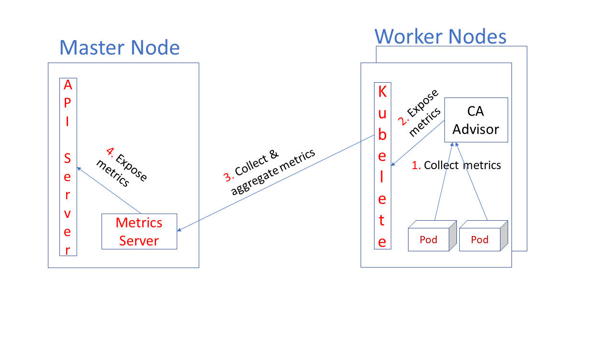
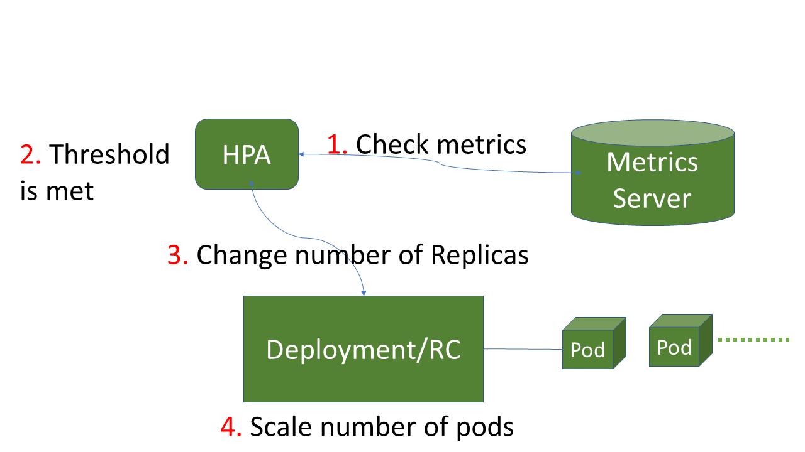

## Table Of Content

## HORIZONTAL POD SCALER

### Definition:
- Automatically scales **number of Pods** in: `replication controller`, `deployment`, `replica set`, or `stateful set`.
- Based metrics: `CPU utilization, or `custom metrics`

- **Precaution**: applies only to `scalable objects` (E.g: `DaemonSets` cant be scaled)

### Why HPA?
- Economical solution
- Enahance H/A & stability of system. Espeacially in the place where traffic subject to strong fluctations.
- **Automation**: reduce the workload for human-operator. 

### Mechanism:
**Horizontal Pod Autoscaler**: implemeneted as a part of `K8S`: `API Resource` & `Controller`. 
		- `Resource`: determines behavior of controller
		- `controller`: periodically adjusts number of replicas in replication controller/deployment --> match `observed metrics` (e.g: avg `CPU utilisation`, `avg mem utilisation`, or other metrics)

		- Implemented as a `control loop`, period controlled by controller's manager  (`--horizontal-pod-autoscaler-sync-period` default 15 secs)

**API Object**: an API resource in `K8S` built-in autoscaling group
	- Support ONLY `CPU autoscaling`at current stable release (`autoscaling/v1`)
	- Support memeory & custom metrics (beta - `autoscaling/v2`)

**How it works**:
	- Each period, `Controller manager` queries resource utilization against pre-specified metrics (in each `HorizontalPodAutoScaler Definition1`)
	- Controller gets metrics from:
		- **Resource metrics API** (per pod-resource metrics):
			- Controller fetches metrics from resource metrics API for each targeted Pod
			- Default: use `utilization value` = `utilization val` --> % of resource request.
			- Can set to use `raw value`i
			- `raw` / `utilization` value collected ---> calculates a `ratio` -----> Scale number of `desired replicas`.

		- **Custom metrics API** (other metrics):
			- Per-pod custom metrics: get `raw values`.
	- As `targetAverageUtilization` specified in advance, `currentMetricValue` = avg / declared metric across all targeting Pods of `HPA`

**Where Metrics Extracted**:
	- `Aggregated API`: `mettrics.k8s.io`, `custom.metrics.k8s.io`, `external.metrics.k8s,id`.
		- `metrics.k8s.io`: 
			- provided by `metrics-server`

	- Heapster

**Alogrithm Explained**:
- **Simplified explaination**: operates on ratio between `desired metric` & `current metric value`.

- Equation: use with Pods which are not set aside/discarded
```bash
desiredReplicas = ceil[currentReplicas * ( currentMetricValue / desiredMetricValue )]
```
	- `ceil`: rounding. set via `--horizontal-pod-autoscaler-toleranc` (default: 0.1)
- When working with multiple metrics:
	- equation is used on each metric --> **LARGEST** of desired replicas is selected
	- **scaling skipped**: some metrics cant be calculated into a replica number (missing?) + a scale down is suggested by metrics that available
	- **scaling continues**: if `desiredReplicas` > current value

**Conditions**: following conditions are taken into consideration before checking `tolerance` & final values is decided:
	- `Pod Readiness`i
		- A Pod will be excluded in cases:
			- Deletion Timestamp set (on Termination)
			- Missing Metrics
			- Has not been ready (e.g: on initializing process)
			- Most recent metrics point was before Pod became ready

	- `Missing Metrics`
	- **Note**: original value for avg utilization reported back via `HPA status` (without considering `not-yet-ready-pods`/`missing metrics`)

**Dealing with missing metrics**: to reduce the workload of potential further scale
- Avg is recalculated `conservatively: assuming the Pod usage as below in specific cases`
	- `scale up`: 0% of desired value
	- `scale down`: 100% of desired value

- With `not-yet-ready-pod`: assume it consuming 0% of desired metric (prevents unnecessary scale up)

**Autoscaling during roolling update**
- HPA:
	- bounds to `Deployment` object --> sets size for deployment object ---> Deplyment sets size for replica sets
	- Does not work with `rolling update` directly with `replication controller`

## Workflow

Using the built-in `Metrics Server.

**Metrics Server**:
	- built-in `K8S` component of autoscaling pipeline. 
	- Scalable, efficient source of container resource metrics

### **Diagram**

#### How `Metric server` works


**Steps**:
	1. Collect metrics: (On `Worker Node`)  Metrics are collected from Pod --> CA Advisor -----> `Kubelete`

	2. Expose metric: At `CA Advisor`, metrics are exposed to be extracted by `Kubelete`
	
	3. Collect & Aggregate metrics: Metrics Server gathers the metrics at `Master Node`
	
	4. Expose Metrics: Metrics are then exposed for extraction to `API Server` by `Metrics Server`.

#### How `Horizontal Pod Autoscaler` works?


**Diagram**:



**Flow**:
1. `Metrics server` retrieves the metrics from Pods ---> sends to `K8S api-server` 
2. `HPA controller` queries `Metricss server` after each defined period (default: 15s)
3. If the values matches the determined policies ---> scale number of Pods

## Features

### Managing with `kubectl`:
Same as other `Resource`s in `K8S`

- Get HPA:
```bash
$ kubectl get hpa
```
....


### Support `cooldown/delay`
- As metrics are dynmic, number of replicas fluctuates frequently. => `thrashing`
=> Can reduce such changes with flags


### Support `resource metrics`

**Pod Metrics**: 
- Should specify resource requests `cpu` + `memory` when definining Pod ---> used by `HPA controller`for scaling `up` + `down`

**Container Resource Metrics**:
- HPA can track resources usage of individual containers across `Pods`
- **Pros**: more micro approach.
- Sample use case: `a web app + logging sidecar`
	- Track resource utilization of `web app` while ignoring `logging` service

```yaml
type: ContainerResource
containerResource:
  name: cpu
  container: application
  target:
    type: Utilization
    averageUtilization: 60
```

### Support multiple metrics
- can use `autoscaling/v2beta` --> multple mtrics for scaling

### Support custom metrics
- `K8S` retrieve values from new customs metrics API
- Add to system using `autoscaling/v2beta2`

### Support for `metrics APIs`:
- **Default**: HPA controller retrieves metrics from APIs
- To-do list to use `metrics API`:
	- `API aggregation layer` enabled
	- Register APIs
		- `metrics.k8s.io`: 
			- Provided by `metrics-server`
			- Launched as `cluster addon`
		- `custom.metrics.k8s.io`:
			- for `custom metrics`
			- offered by API servers from vendor
		- `external.metrics.k8s.io`:
			- provided by custom metrics adapters


### Highly configurable Scaling behavior:

`scaleUp` & `scaleDown` policies can be configured under `behavior` field.


- `scaleUp` / `scaleDown` behavior can be `Disabled`.

#### Scaling Policies
- >= 1 policies can be declared
- Some parameters/behaviours can be configured: 
	- `max num of replicas to be scaled in a specific period of time`

### Scaling window
- Puts restrictions to deal with scenerios when scaling metrics not stable ---> keep scaling too much 
	- Example: put condition to check only `highest value` in the last x minutes

### Resource Metrics Pipeline

#### Basic
- Allowing K8S to access metrics, support other component to make decisions.
- Access/View:
	- CLI: `kubectl top`
	- Controller in cluser (e.g: HPA)

### Implementations of `Metrics API`s (/Types):

**Resource Metrics API**
- Heapster
- Metric Server

**Custom Metrics API**: externally integrated. 
- `Prometheus Adapter`
- `Microsoft Azure Adapter`


### Mechanism of `Metrics API`
- **Core**: exposes metrics via endpoint => not a DB --> cant not retrieve metrics from the past

### Features of `Metrics API`:
- Discoverable via endpoints
- Provides system gurantees: security, scalability, reliability

### Available Metrics
**CPU**:
- avg usage over period of time


**Memory**
- Report as `working set` (in bytes) at instant metric collected
	- `working set` - memory cant be freed under `memory pressure`. Includes all `anonymous mem` + `cached mem`

### Metrics Server:
- `Cluster-wide aggregator of resource usage data`
- Require to be deployed as `Deployment` object
- Gathers metrics from `Summary API` (exposed by `Kubelet` on each worker node) 


## KEDA - `Kubernetes-based Event-driven Autoscaling`

### What is `KEDA`?:
- a `Kubernetes-based Event-driven Autoscaling` --> scale event based on on-processing number of events
- Offical `CNCF` Project
- Built on top of `Kubernetes HPA`, extending its functionality. Acts an comprehensive alternative for built-in `Metrics server` (`Prometheus` requires adapter)

### Why `KEDA`?
- Ensure the native/friendliness with `Kubernetes cluster` => safety & flexible solution to run together with any other `K8S` components.
- Extend funcion of `HPA` without the need of overwriting/duplication while working on `K8s`
- Event-driven architecture
- **Lightweight & Single-purpose**
- `Open-source` => Free to use


### Installation:
Various ways to deploy: refer to this (link)[https://keda.sh/docs/2.3/deploy/]

- `Helm`
- `Operator Hub`
- `Deployment manifest` 

### Features
- Event-driven
- Simple auto-scaling
- Built-in scalers
- Multiple Workload Types
- Vendor-Agnostic 
- Support `Azure` Functions


### How it works?

2 key roles within `K8S`:

1. **Agent**:
- Activates/deactivates K8S Deployments --> scaling based on events
- Done by `keda-operator`

2. **Metrics** 
- Acts in the same role of `Metrics Server` -> exposing rich event data to HPA ---> HPA fetch metrics from here ---> scale pods.
- Executed within `keda-operator-metrics-apiserver`


**Custom Resources in `KEDA`**: brings up at install
- `ScaledObjects`: mapping between `event source` (e.g: `RabbitMQ`, `Prome`) & `K8S Resources` (e.g: Deployment, StatefulSet, CR,...)
- `ScaledJobs`: mapping between event source & `K8S` Job
- `TriggerAuthentication`/`ClusterTriggerAuthentication`: contains auth config / secrets to monitor event source. Likely to be refered by `ScaledObjects` and `ScaledJobs` 

### Architecture & Components:

**Deployment Architecture**
- Runs on `Kubernetes Cluster`


**Components**
- **Scaler**: 
	- **What it does?**
		- Connect to `external component`
		- Fetch Metrics 
	- Defined by `ScaledObject` manifest
	- **Purpose**: integrating w/ an `external source`/triggers as specified in `ScaledObject` --> fetch metrics + present to `Metrics Server` of KEDA
	- **Some scalers**: `Prometheus`, `Apache Kafka`,...

- **Operator/Agent**: 
	- **What it does?**
		- `activating`/`deactivating` Deployment
		- creating `HPA` object
	- Contains a `controller` --> `reconciliation loop`
	- **Purpose**: agent --> `activate` & `deactivate` Deployment to scale to & from zero 
	- **Workflow**:  `ScaledObject` created ---> `Agent` responses by creating a `HPA`
			- **Note**: `KEDA` vs `HPA` 
					- `KDA`: scaling deployment from/to 0 <--> 1
					- `HPA`: auto scaling when `Deployment` is on.

- **Metrics Adapter**:
		- Translating `metrics` from external sources ---> format that consumable by `Autoscaler` --> drive `autoscaling`
		- Exposing metrics from `External Source` to `HPA` 

### Sample `KEDA` Usage
Deploying a sample app

1. Create a `Deployment`: for application

2. Create a `ScaledObject` (CRD): define `source of metrics`, `autoscaling criteria`


## PROMETHEUS

### What is `Prometheus`?

- Opensource **systems monitoring** & **alerting solution**.
- Originally built at `SoundCloud`. Now a project of `CNCF` - ranks 2nd priority behind `Kubernetes`
- Written mostly in `Go`. Other compoennts in `Java`, `Python`, `Ruby`.

### Why `Prometheus`?

- **Open-source**
- Widely adopted on various systems 
- Battle-hardened
- Suitable for `microservices` --> just need to expose a `metrics port`.

### Features

- **Multi-dimentional Data model**: time series data using metric & key-val pairs to identify. 
- Offer the powerful, dynamic `PromQL` - **Prometheus Query Language**
- Single-node architecture. No **distributed storage**.
- Time series data collection is executed via a `pull`-based model via HTTP request.
- Monitoring targets are **discoverable** via `service discovery` (*dynamic*)/`static config`.
- Support multiple modes of graphing/dashboarding
- **Pushing time series** is executed via an intermediary gateway
- **Metrics** follow the **`OpenMetrics` standard**. 

## Architecture & Components

**Architecture**

`Prometheus` scrapes/fetches metrics from designted `Jobs` either via: *`Gateway` for short-lived jobs*, *direct*.
Data are stores locally on single-node. 
`Prometheus` runs rules over this data to: 
	- `aggregate` & `record` new time serires from exisiting data
	- generate alerts


**Components**
Includes multiple components. Some of which are optional

- **Prometheus Server**: scraping & store `time-series` data.

- **Client libraries**: libs written in some lanaguage. Allowing user to interacting with application code, customize/build their own collectors to pull metrics from other systems & expose to `Prome`.

- **Push Gateway**: allow ephemeral and batch jobs to expose their metrics to Prometheus.
	- **Workflow**: due to the fact that these jobs may not last enough for scraping.
				
				Jobs |------------------> Pushgateway |------------------> `Prometheus`
						  push metrics  				      exposes						

- **Exporters**: 
	- **Goal**: 
		- exporting existing metrics from 3rd party systems & format them to `Prometheus` standard.
		- Expose a endpoint (`web service api`) for `Prometheus` to pull/Push to `Prome` 

- **Alertmanager**: hanldes & mangages alerts received from client apps (e.g: `Prome server`)
	- **Goal**: `deduplicating`, `grouping`, `routing` to correct receiver (*Email, text,...*)

....

### CONCEPTS

**Data model**
`Prometheus` stores data as `time series` - `streams of timestamped vals belonging to same metric & same set of labeled dimensions`.
Identifiction for `time serirees`: 
	- **Metric name**
	- **Labels**: key-val pairs

```bash
<metric name>{<label name>=<label value>, ...}
```
- **Sample/Data point**: containing `time-series data`. `(timestamp, value)` pair
	- float64 val
	- milisecond-precision timestamp

**Metrics Types**: main metrics type of `Prometheus` can be listed as below
- **Gauge**: value, can go up/down at any time.  (e.g: mem usage, cpu usage)

- **Counter**: value starting from 0. always increment. (e.g: request count)

- **Summary**: set of pre-configured percentiles for val. 

- **Histogram**: set of counters for different value ranges.

**Jobs & Instances**:
- **Instance**: endpoint that metric scrapable. correspond to single process.

- **Job**: collection of instances w/ same purpose -> replicated for `scalability` + `reliability` (e.g: Pods)
		- E.g: Job: `to-do-application-server`
			- instance 1: `192.168.80.132:3000`
			- instance 1: `192.168.90.130:3001`
			- instance 1: `192.168.100.133:3002`

*When a target is being scraped, some labels are automatically attached tp scraped time series*

### Installation

- From `Go` source code
- Docker Image
- Precompiled Binary
- Configuration Management System: `Ansible`, `Saltstack`,...

### Use Case
`collect numeric metrics from a service that is running 24/7 and does expose the metrics on an HTTP(S) endpoint`
- Suitable for monitoring `Pods` running on `Kubernetes` - which requires stability & high availability


### Integration with `Kubernetes`:
Optimize the **automation** during configuration with [Prometheus Operator](https://github.com/prometheus-operator/prometheus-operator).

