# Week 2 -

## **Lab 1**: Simple `Autoscaler` with built-in `Horizontal Pod Autoscaler` & `Grafana`  

### Set up workspace

**Metrics Server**
Required to extract metrics from running Pods

- Deploy `Metrics Server`: `to collect metrics`

```bash
$ kubectl apply -f https://github.com/kubernetes-sigs/metrics-server/releases/latest/download/components.yaml
```
 
> `tls` related issues might arise during installation of `metrics-server`

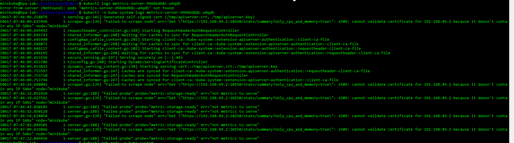

- Edit `metrics-server` file & add following argument to allow `insure-tls`:

```bash
$ kubectl edit deployments.apps -n kube-system metrics-server

----
...

containers:
- args:
  - --kubelet-insecure-tls
...

```

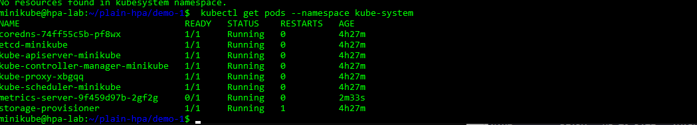

### Steps-by-steps

- Create `Deployment` file for `php-apache` application:

```yaml
apiVersion: apps/v1
kind: Deployment
metadata:
  name: php-apache
spec:
  selector:
    matchLabels:
      run: php-apache
  replicas: 1
  template:
    metadata:
      labels:
        run: php-apache
    spec:
      containers:
      - name: php-apache
        image: k8s.gcr.io/hpa-example
        ports:
        - containerPort: 80
        resources:
          limits:
            cpu: 500m
          requests:
            cpu: 200m
---
apiVersion: v1
kind: Service
metadata:
  name: php-apache
  labels:
    run: php-apache
spec:
  ports:
  - port: 80
  selector:
    run: php-apache
```

- Run `php-apache` application:

```bash
$ kubectl apply -f <path>/php-apache-deploy.yaml
```

- Deploy a `HPA - Horizontal Pod Autoscaler` on cluster:

```bash
$ kubectl autoscale deployment  php-apache-d4cf67d68-q9j4h --cpu-percent=50 --min=1 --max=10
```

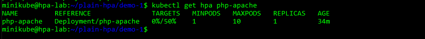

- Perform `stress-test` on `phph-apache` application with `BusyBox`:

> This Pod execute an infinite `Pod` to overload `CPU` usage of Pod in order to enforce `HPA` pre-defined rule. 

```bash
$ kubectl run -i --tty load-generator --rm --image=busybox --restart=Never -- /bin/sh -c "while sleep 0.01; do wget -q -O- http://php-apache; done"
```
  - Declarative format:

  ```yaml
  apiVersion: apps/v1
  kind: Deployment
  metadata:
    name: stress-test
    labels:
      app: stress-test
  spec:
    replicas: 1
    selector:
      matchLabels:
        app: stress-test
    template
      metadata:
        name: stress-test
        labels:
          app: stress-test
  spec:
        containers:
        - name: stress-test
          image: busybox
          command:
          - /bin/sh
          - -c
          - "while true; do wget -q -O- http://php-apache; done"
  ```

### Expected Outcomes

- Automatically scales up number of `Pods` when `CPU utilization` reached defined policy:

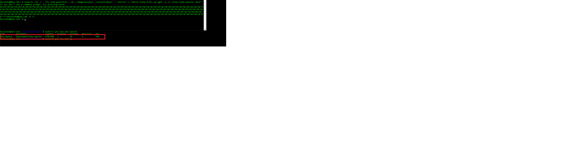

- Automatically scales down number of `Pods` when workload down:

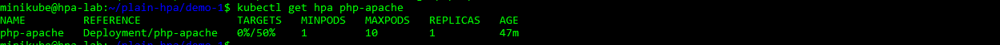

## **Lab #2**: Autoscale an Application on `Kubernetes` with  `KEDA`  & `Prometheus` via `Exporter`

### Design

```
      Application ----------> Exporter ----------> Prometheus
                                                        |
                                                        |
                                                        |
                                                    ----------
                                                    |  KEDA  |
                                                    ----------
                                                        |
                                                        |
                                                        |
                                                    ----------
                                                    |   HPA  |
                                                    ----------

```

### Planning
> An simple outline for this lab can be described as below

1. Environment Setup:
  - Install `HELM` - Package Manager for `Kubernetes`

2. Install:
  - `KEDA` 
  - `Prometheus` via `kube-prometheus-stack` - collection of Kubernetes manifests, Grafana dashboards, and Prometheus rules combined with documentation and scripts.

3. Configure `Exporter`

4. Build `ScaledObject` manifest 

### Steps-by-steps

- Enviroment setup
  - Install `HELM`:
    
    ```bash
    
    $ curl -fsSL -o get_helm.sh https://raw.githubusercontent.com/helm/helm/master/scripts/get-helm-3
    $ chmod 700 get_helm.sh
    $ ./get_helm.sh
    ```
- Install `KEDA` (Can be install either using `HELM` or `manifests`):

> `Helm` is used in this Deployment:

  - Add `Helm` Repo:
  
  ```bash
  $ helm repo add kedacore https://kedacore.github.io/charts
  ```

  - Update repo:

  ```bash
  $ helm repo update
  ```

  - Install `KEDA`:
  
  ```bash
  $ kubectl create namespace keda         #Create a namespace for KEDA

  $ helm install keda kedacore/keda --version 2.0.0 --namespace keda
  ```
  
  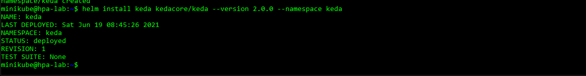

- `Prometheus-stack`:
  - Add & update repo:
  
  ```bash
  $ helm repo add prometheus-community https://prometheus-community.github.io/helm-charts
  $ helm repo update
  ```

  - Install Chart
  
  ```bash
  $ helm install prometheus prometheus-community/kube-prometheus-stack
  ```
  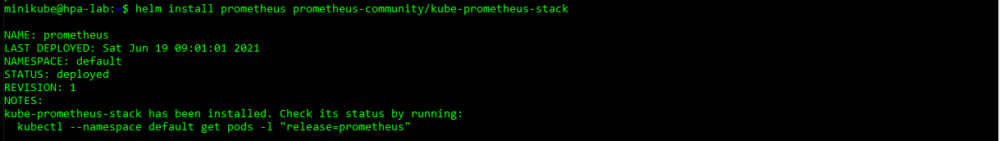

  - Verify `Prometheus` & other components running on Pods:

  ```bash
  $ kubectl get servicemonitor

  $ kubectl get pods
  ``` 
  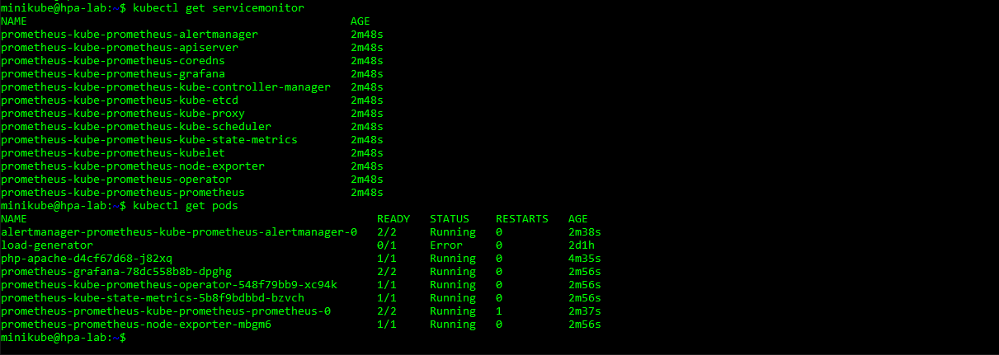

  - View default config of `Prometheus`:
  
  ```bash
  $ kubectl get servicemonitor prometheus-kube-prometheus-prometheus -oyaml
  ```
  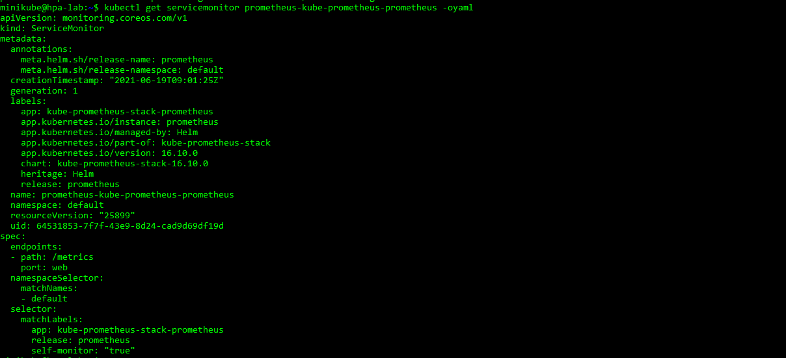

  - View Monitoring config of `Prometheus`:
  
  ```bash
  $ kubectl get prometheuses.monitoring.coreos.com -oyaml
  ```
  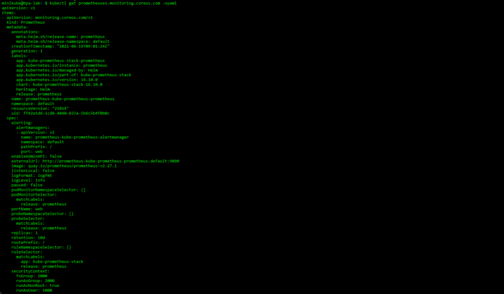

- Deploy a sample `MySQL` application on `Kubernetes`:
  - Create `yaml` manifest:
    ```yaml
    $ vi deploy-mysql.yaml
    ---

    apiVersion: v1
    kind: Service
    metadata:
     name: mysql-service
    spec:
     selector:
      app: mysql
     ports:
     - protocol: TCP
       port: 3306
       targetPort: 3306
    ---
    apiVersion: apps/v1
    kind: Deployment
    metadata:
      name: mysql
    spec:
      selector:
        matchLabels:
          app: mysql
      template:
        metadata:
          labels:
            app: mysql
        spec:
          containers:
          - image: mysql:5.6
            name: mysql
            env:
            # Use secret in real usage
            - name: MYSQL_ROOT_PASSWORD
              value: pass
            - name: MYSQL_USER
              value: test
            - name: MYSQL_PASSWORD
              value: pass
            ports:
            - containerPort: 3306
              name: mysql
    ```

  - Deploy on `Kubernetes`:

  ```bash
  $ kubectl apply -f deploy-mysql.yaml
  ```
- Deploy `MySQL-Exporter` on `Kubernetes` Cluser:

  - (Optional) Add & update repo:
  ```bash
  $ helm repo add prometheus-community https://prometheus-community.github.io/helm-charts
  $ helm repo update
  ```
  
  - Integreate `mysql-exporter`:
    - Create `values.yml`
    
    ```yaml
    
    $ vi values.yml
    
    ---
    mysql:
      host: "mysql-service"
      pass: ""
      port: 3306
      protocol: ""
      user: ""
    serviceMonitor:
      additionalLabels:
       release: prometheus
       enabled: true
    ```

    **Explain fields**
    `mysql`: configurations for connection to `MySQL`
    `additionalLabels`:  Support `ServiceDiscovery` feature of `Prometheus`, which automatically detects endpoints for data scraping.
   	`enabled`: activate `mysql-exporter` as a `SerivceMonitor` on Cluster
    
    - Install via `Helm`:
    ```bash
    $ helm install mysql-exporter prometheus-community/prometheus-mysql-exporter -f values.yaml
    ```

      - Verify that `mysql-exporter` is `UP & RUNNING`: (Run on another `Terminal`)
    ```bash
    $  kubectl port-forward --address=0.0.0.0 svc/<name-of-mysql-exporter-service> 9104:9104
    ```
        - Check via browser: `http://192.168.80.165/metrics`:
        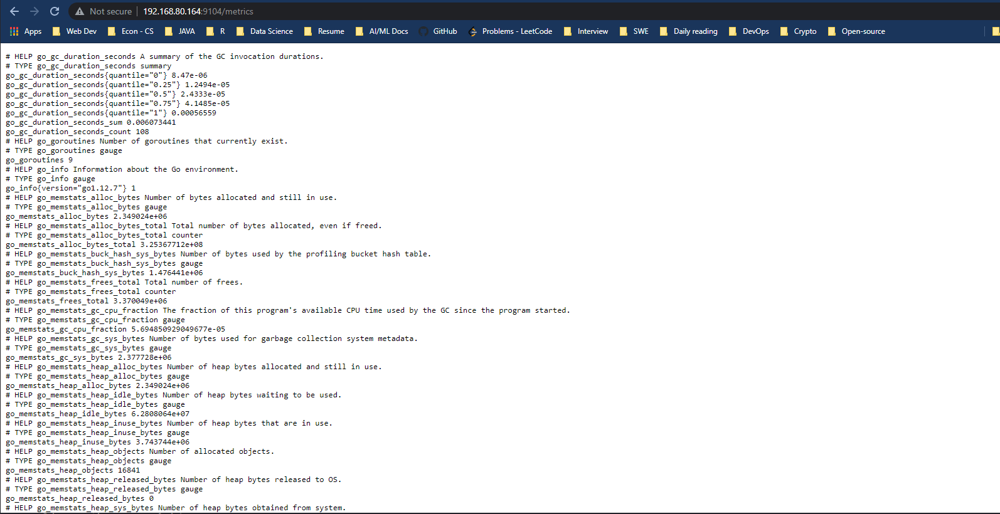

    - `Prometheus` discovered `Target`:
    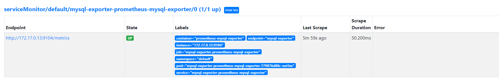


**Note**: multiple options to deploy. Via `Helm` quite convenient.

- Create a dummy to-scale object in `Kubernetes`:
  
  > Why `alpine`? Lightweight `Docker` container.

  - Write `manifest`:
    ```yaml
    $ vi dummy-alpine.yaml
    ---
    apiVersion: apps/v1
    kind: Deployment
    metadata:
      name: alpine-dummy
    spec:
      selector:
        matchLabels:
          app: alpine
      replicas: 
      template:
        metadata:
          labels:
            app: alpine
        spec:
          containers:
          - name: alpine
            image: alpine
            command:
            - /bin/sh
            - "-c"
            - "sleep 60m"
            resources:
              limits:
                memory: "128Mi"
                cpu: "100m"
    ```
    - Create `Deployment`:
    ```bash
    $ kubectl apply -f dummy-alpine.yaml
    ```

- Build `ScaledObject` manifest for `KEDA`:
  - Create manifest:
  ```yaml
  $ vi scaled-object-mysql.yaml
  
  ---
  apiVersion: keda.sh/v1alpha1
  kind: ScaledObject
  metadata:
    name: prometheus-scaled-object
    namespace: default
    labels:
      deploymentName: mysql
  spec:
    scaleTargetRef:
      deploymentName: alpine-dummy
    pollingInterval: 15  
    cooldownPeriod:  30 
    minReplicaCount: 1   
    maxReplicaCount: 8 
    triggers:
    - type: prometheus
      metadata:
        # Required
        serverAddress: http://prometheus-kube-prometheus-prometheus.default.svc.cluster.local:9090
        metricName: access_frequency
        threshold: '4'
        query: mysql_global_status_max_used_connections
  ```
  **Note**: `keda.k8s.io/v1alpha1` should be replaced by `keda.sh/v1alpha1`. ([Migration - KEDA Official Doc](https://keda.sh/docs/2.0/migration/))
  - Apply:
  ```bash
  $ kubectl apply -f scaled-object-mysql.yaml
  ```

## :heavy_check_mark: Expected outcome:

- Dummy Pod - `alpine-dummy` is scaled:

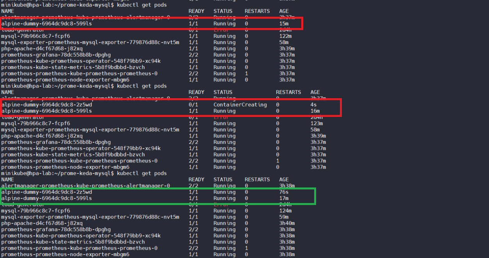