# Week 3


## Lab #1:  *Scaling with multiple metrics from `WordPress` & `MySQL` applications*

### Goal

*Test capability of `KEDA` in scaling multiple types of metrics from various applications*

### Planning

Deploy & scale `WordPress` & `MySQL` on `Kubernetes`. 

- `Bitnami MariaDB`
- `Bitnami WordPress`

[Visit Repository](https://github.com/bitnami/bitnami-docker-wordpress)


### Requirements

A `Minikube Kubernetes Cluster` should be installed in advanced with following add-ons:
- `KEDA`
- `kube-prometheus-stack`
- `Helm`

### Step-by-step

#### Enviroment Setup

**Stress-test tool**

`apache2-utils` - Provides some add-on programs useful for any web server. One of the feature inlcudes conducting a benchmark test on system.

Install via `apt`
```bash
$ sudo apt-get install apache2-utils
```

#### Application 

**MariaDB**

- Creating deployment manifest

```yaml

$  vi mariadb-deployment.yml 

---
apiVersion: v1
kind: Service
metadata:
  name: wordpress-mariadb
  labels:
    app: wordpress-k8s
spec:
  ports:
    - port: 3306
  selector:
    app: wordpress-k8s
    tier: mariadb
---
apiVersion: v1
kind: PersistentVolumeClaim
metadata: 
  name: wordpress-mariadb-volume
  labels:
    app: wordpress-k8s
spec:
  accessModes:
    - ReadWriteOnce
  resources:
    requests:
      storage: 2Gi
---
apiVersion: apps/v1
kind: Deployment
metadata:
  name: wordpress-mariadb
  labels:
    app: wordpress-k8s
spec:
  selector: 
    matchLabels:
      app: wordpress-k8s
      tier: mariadb
  strategy:
    type: Recreate
  template:
    metadata:
      labels:
        app: wordpress-k8s
        tier: mariadb
    spec:
      containers:
      - name: mariadb
        image: bitnami/mariadb:latest
        resources:
          requests:
            memory: "48Mi"
            cpu: 1m
          limits:
            memory: "156Mi"
            cpu: 50m
        env:
        - name: ALLOW_EMPTY_PASSWORD
          value: "yes"
        - name: MARIADB_USER
          value: "test"
        - name: MARIADB_DATABASE
          value: "sample"
        - name: MARIADB_PASSWORD
          value: "1234"
        ports:
        - containerPort: 3306
        name: mariadb
        volumeMounts:
        - name: mariadb-volume
          mountPath: /var/lib/mariadb
      volumes:
      - name: mariadb-volume
        persistentVolumeClaim:
          claimName: wordpress-mariadb-volume
```

- Create `K8S` Objects:

```bash
$ kubectl apply -f <path>/mariadb-deployment.yml
```

**WordPress**

- Creating deployment manifest
```yaml

$ vi wordpress-deployment.yml

---
apiVersion: v1
kind: Service
metadata:
  name: wordpress
  labels:
    app: wordpress-k8s
spec:
  ports:
    - port: 8080
  selector:
    app: wordpress-k8s
    tier: frontend
  type: NodePort
---
apiVersion: v1
kind: PersistentVolumeClaim
metadata:
  name: wordpress-volume
  labels:
    app: wordpress
spec:
  accessModes:
    - ReadWriteOnce
  resources:
    requests:
      storage: 2Gi
---
apiVersion: apps/v1
kind: Deployment
metadata:
  name: wordpress
  labels:
    app: wordpress-k8s
spec:
  selector:
    matchLabels:
      app: wordpress-k8s
      tier: frontend
  strategy:
    type: Recreate
  template:
    metadata:
      labels:
        app: wordpress-k8s
        tier: frontend
    spec:
      containers:
      - name: wordpress
        image: bitnami/wordpress:latest
        resources:
          requests:
            memory: "48Mi"
            cpu: 5m
          limits:
            memory: "248Mi"
            cpu: 150m
        env:
          - name: ALLOW_EMPTY_PASSWORD
            value: "yes"
          - name: WORDPRESS_DATABASE_USER
            value: "test"
          - name: WORDPRESS_DATABASE_NAME
            value: "sample"
          - name: WORDPRESS_DATABASE_PASSWORD
            valueF: "1234"
        ports:
        - containerPort: 80
        name: wordpress
        volumeMounts:
        - name: wordpress-storage
          mountPath: /var/www/html
      volumes:
      - name: wordpress-storage
        persistentVolumeClaim:
          claimName: wordpress-volume
```

- Create `K8S` Objects:

```bash
$ kubectl apply -f <path>/wordpress-deployment.yml
```

- Retrieve `URL` of service

```bash
$ minikube service wordpress --url
```


**Before Proceeding**: *Ensure both Pods are up*

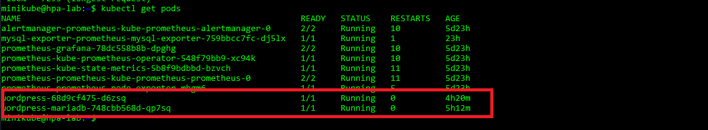

#### Prometheus & `exporters`

Verify that `exporters` have discovered by `Prometheus` via `Prometheus`'s Dashboard

**Note**: `WordPress` is monitored by `kube-state-metrics` exporter, which is installed by *default* with `kube-prome-stack`.

- `MySQL exporter`
- `kube-state-metrics`

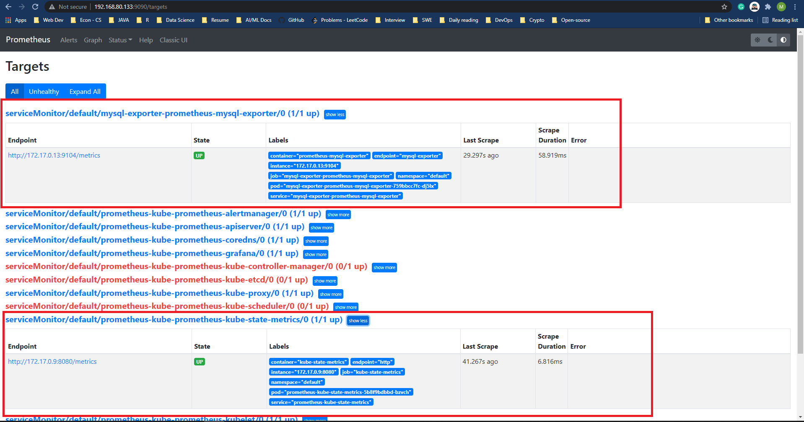


Test `PromQL` query via `Prometheus` Dashboard

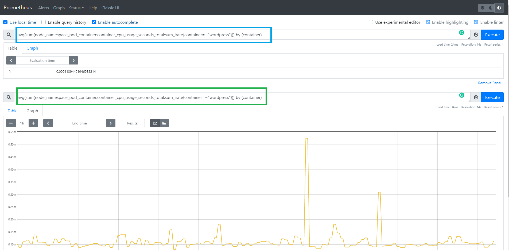

#### Grafana

Accessing `Grafana` Dashboard

- **Note**: *Default Login credentials*

  ```bash
  Username: admin 
  Password: prom-operator
  ```

- Expose `Grafana` to host machine via port `3000`

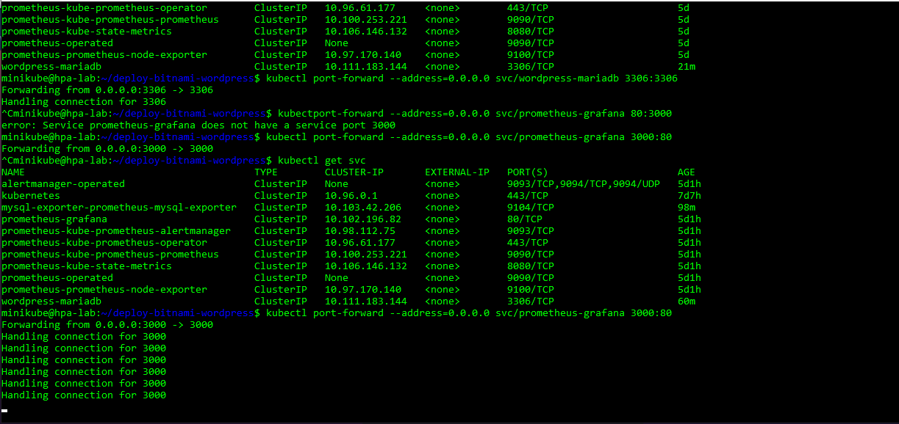

- Login Page

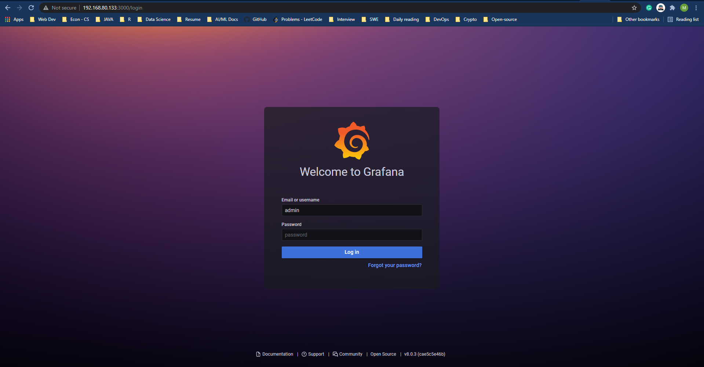

**`PromQL` Query for `Grafana`'s panels**

Total Pods in `default` namespace

```sql
count(kube_pod_info{namespace="default"})
```

**CPU Usage**

- CPU Usage (in seconds)

```sql
sum(node_namespace_pod_container:container_cpu_usage_seconds_total:sum_irate{namespace="$namespace", pod="$pod", cluster="$cluster"}) by (container)
```

- Container CPU requests

```sql
sum(kube_pod_container_resource_requests{cluster="$cluster", namespace="$namespace", pod="$pod", resource="cpu"})
```

- (*If `CPU limits` is set in `Deployment`*) Container CPU limits:

```sql
sum(kube_pod_container_resource_limits{cluster="$cluster", namespace="$namespace", pod="$pod", resource="cpu"})
```

**Memory Usage** (Container level)

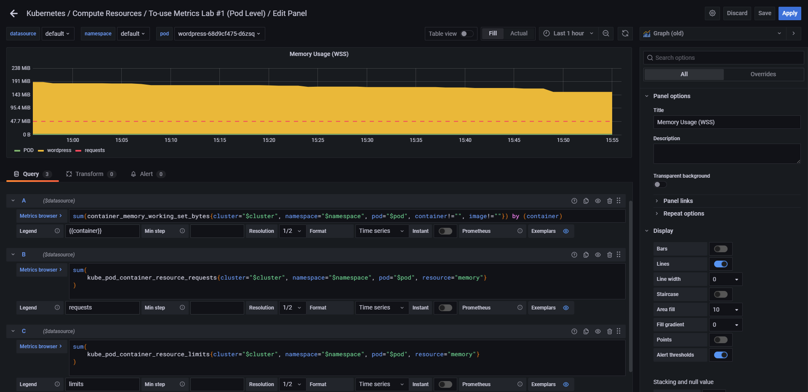

- Memory Usage 

```sql
sum(container_memory_working_set_bytes{cluster="$cluster", namespace="$namespace", pod="$pod", container!="", image!=""}) by (container)
```

- Container Memory requests

```sql
sum(kube_pod_container_resource_requests{cluster="$cluster", namespace="$namespace", pod="$pod", resource="memory"})
```

- (*If `Memory limits` is set in `Deployment`*) Container Memory limits:

```sql
sum(kube_pod_container_resource_limits{cluster="$cluster", namespace="$namespace", pod="$pod", resource="memory"})
```

**Expected Dashboard**

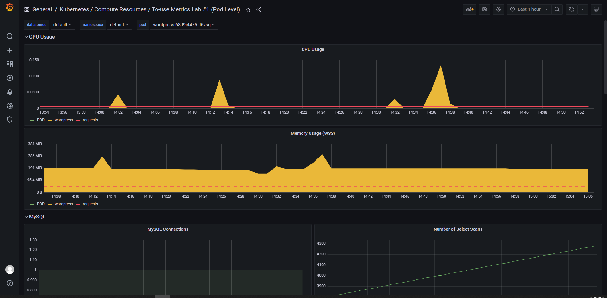

#### Scaling with `KEDA`

**Note**: *Some metrics are taken into consideration*

- **MySQL**
  - `Total Connections`
  - `Select Scan` : *how many queries caused full table scans, in which all the data in the table had to be read and either discarded or returned*.
- **WordPress**
  - `CPU Usage`
  - `Memory`

Build dummy `Deployment` on `Kubernetes`:

- Create `manifests`:
  - `alpine-dummy`

  ```yaml

  $ vi alpine-dummy.yml
  ---
  ---
  apiVersion: apps/v1
  kind: Deployment
  metadata:
    name: alpine-dummy
  spec:
    selector:
      matchLabels:
        app: alpine
    replicas: 
    template:
      metadata:
        labels:
          app: alpine
      spec:
        containers:
        - name: alpine
          image: alpine
          command:
          - /bin/sh
          - "-c"
          - "sleep 60m"
          resources:
            limits:
              memory: "128Mi"
              cpu: "100m"
  ```

  - `mariadb-alpine-dummy`:

  ```yaml
  $ vi mariadb-alpine-dummy.yaml
  ---
  apiVersion: apps/v1
  kind: Deployment
  metadata:
    name: mariadb-alpine-dummy
  spec:
    selector:
      matchLabels:
        app: alpine
    replicas: 
    template:
      metadata:
        labels:
          app: alpine
      spec:
        containers:
        - name: alpine
          image: alpine
          command:
          - /bin/sh
          - "-c"
          - "sleep 60m"
          resources:
            limits:
              memory: "128Mi"
              cpu: "100m"
  ```

- Create `Deployment` on `Kubernetes`:

```bash
$ kubectl apply -f <deployment>.yml
```

- Verify dummy `Deployment` are up

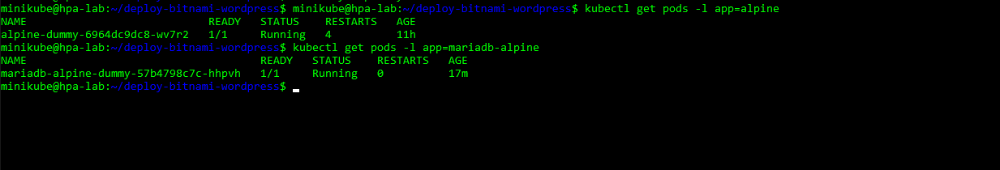

Build `ScaledObject`:

- **WordPress**:
 
>  **1 MiB** = 1048576 bytes. Then we need to divide by `1048576` the `container_memory_working_set_byte` to convert it to **MiB**

```yaml
$ vi wordpress-scaled-object.yml

---
apiVersion: keda.k8s.io/v1alpha1
kind: ScaledObject
metadata:
  name: wordpress-scaled-object
  namespace: default
  labels:
    deploymentName: worpress-autoscale
spec:
  scaleTargetRef:
    name: alpine-dummy
  pollingInterval: 15  
  cooldownPeriod:  15 
  minReplicaCount: 1   
  maxReplicaCount: 10 
  triggers:
  - type: prometheus
    metadata:
      serverAddress: http://prometheus-kube-prometheus-prometheus.default.svc.cluster.local:9090
      metricName: cpu_usage_wordpress
      threshold: "0.001"
      query: ceil(avg(sum(node_namespace_pod_container:container_cpu_usage_seconds_total:sum_irate{container=~"wordpress"})) by (container) * 10)        #CPU Usage of WordpPress Pod(s)
  - type: prometheus
    metadata:   
      serverAddress: http://prometheus-kube-prometheus-prometheus.default.svc.cluster.local:9090
      metricName: memory_usage_wordpress
      threshold: "524288000"					  #500MiB
      query: ceil(avg(sum(container_memory_working_set_bytes{image!="", container=~"wordpress"})) by (container) / 1048576)      #Memory Usage of WordPress Pod(s))
```

- **MariaDB**

```yaml
$ vi mariadb-scaled-object.yml
---
apiVersion: keda.k8s.io/v1alpha1
kind: ScaledObject
metadata:
  name: mariadb-scaled-object
  namespace: default
  labels:
    deploymentName: mariadb-autoscale
spec:
  scaleTargetRef:
    name: mariadb-alpine-dummy
  pollingInterval: 15  # Optional. Default: 30 seconds
  cooldownPeriod:  15 # Optional. Default: 300 seconds
  minReplicaCount: 1   # Optional. Default: 0
  maxReplicaCount: 10 # Optional. Default: 100
  triggers:
  - type: prometheus
    metadata:
      serverAddress: http://prometheus-kube-prometheus-prometheus.default.svc.cluster.local:9090
      metricName: mysql_total_connections
      threshold: "2"
      query: count(mysql_global_status_threads_connected)        #Total connections to MariaDB
  - type: prometheus
    metadata:
      serverAddress: http://prometheus-kube-prometheus-prometheus.default.svc.cluster.local:9090
      metricName: mysql_global_status_select_scan
      threshold: "2800"
      query: mysql_global_status_select_scan        #Total connections to MariaDB
```

Create `ScaledObject` on `K8S` Cluster

```bash

$ kubectl apply -f <path>/wordpress-scaled-object.yml 
$ kubectl apply -f <path>/mariadb-scaled-object.yml 
```

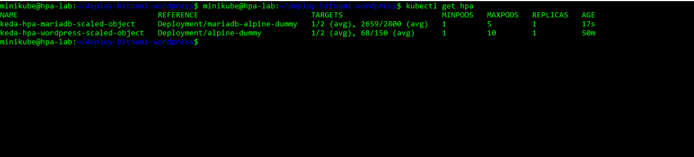

Verify that `HPA` Object is ready

```bash
$ kubectl get hpa
```

#### Scaling Simulation & Perform stress-test

Perform stress-test with `Apache` benchmarking tool.

- Retriving URL of `wordpress` application:

```bash
$ minikube service wordpress --url
```

- Run stress-test

```bash
$ ab -c <concurrency> -n <requests> -r <URL-of-`wordpress`>
```

**Explain options**:

- `-c`: *number of multiple requests to perform at a time*
- `-n`: *total number of requests to perform for the session*

```bash
$ ab -c 30 -n 130 -r http://192.168.49.2:30598/
```

### :heavy_check_mark: Expected Outcomes

#### **Pre-Simulation**

`Grafana` Dashboard before the `simulation` initiates.

- `MySQL` metrics & `Total Pod number`

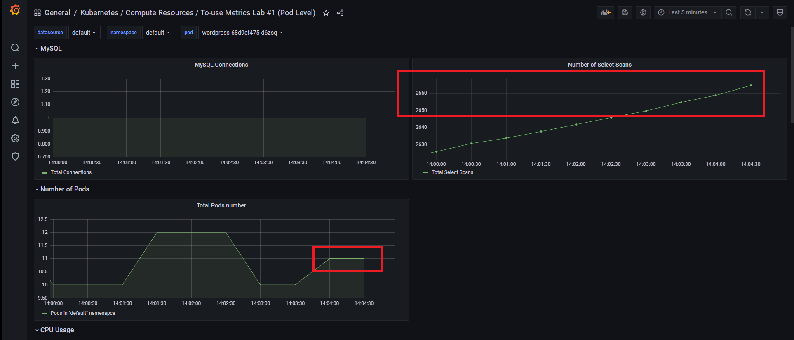

- `CPU Usage` & `RAM Usage`

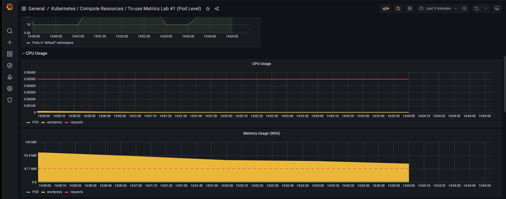

#### **Simulation**

Check on `Horizontal Pod Autoscaler`:

- Metrics surges, `Autoscaling` begins.

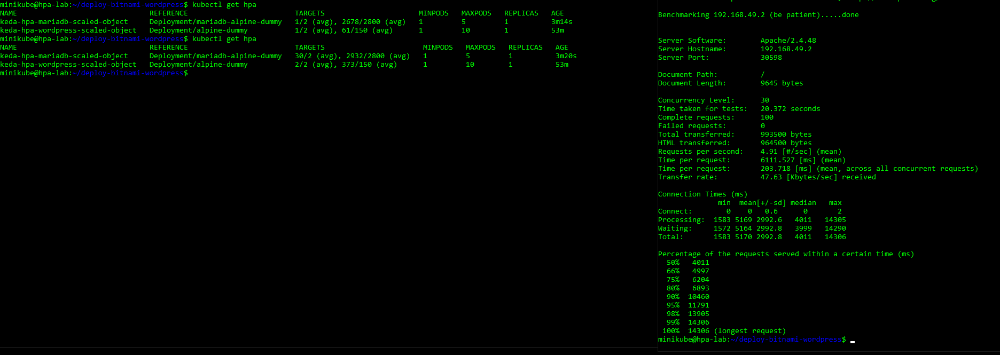

- `Scaling` starts. Number of `Replicas` increases.

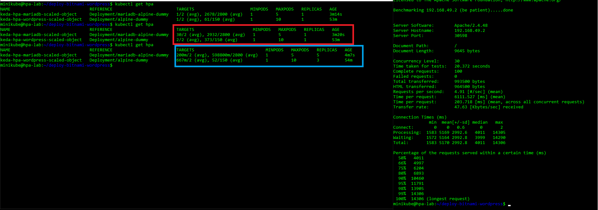

Verify changes in terms of applications' performance on `Grafana` Dashboard

- `Number of Pods` increases.
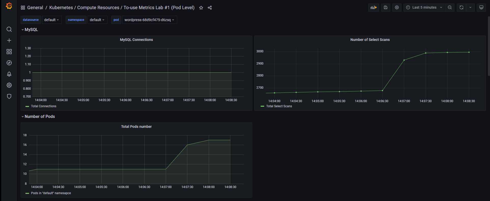

- `CPU Usage` & `RAM Usage` surges significantly.
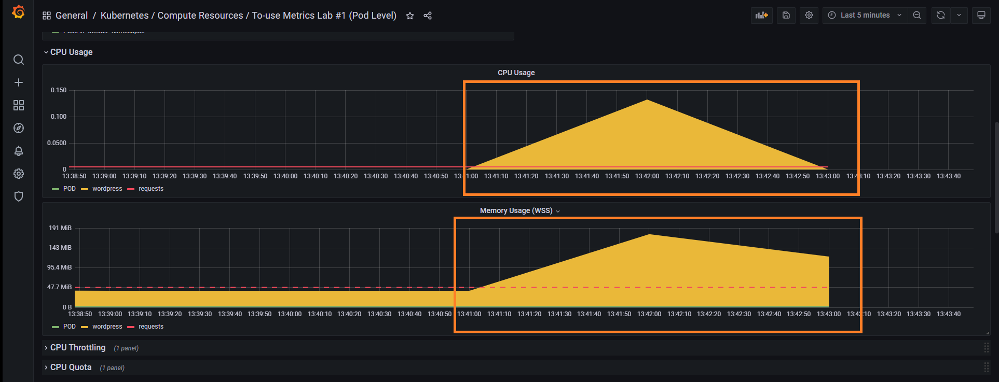


Verify changes in pod quantity via `kubectl`

```bash
$ kubectl get pods
``` 

- `alpine-dummy`: 3 replicas
- `mariadb-alpine-dummy`: 5 replicas

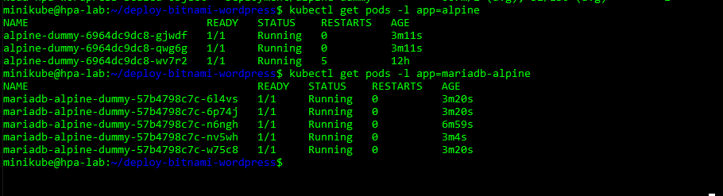


## Lab #2:  *Scaling with metric from `RabbitMQ`*

### Goal

*Test capability of `KEDA` in scaling multiple types of metrics from various applications*

*Integrate `RabbitMQ` metrics with `Prometheus`*

### Planning

Deploy & scale `RabbitMQ` & `Go` application to `Kubernetes`. 

- Deploy a sample `Go` Appplition 
  - [View GitHub Repo](https://github.com/brancz/prometheus-example-app)

- Deploy `Bitnami RabbiMQ` 
  - [Visit Repository](https://github.com/bitnami/bitnami-docker-rabbitmq) 

### Requirements

A `Minikube Kubernetes Cluster` should be installed in advanced with following add-ons:

- `KEDA`
- `kube-prometheus-stack`
- `Helm`

Benchmark testing tool. View [#Lab 1](#Lab-1) for installation & usage guidance.

- `apache2-utils` 

### Step-by-step

#### Deploy `Go` Application & Integrate with `Prometheus`

Build manifests for application:

- **Note**: *all manifest are written to `go-app-deployment.yml`*

- `Deployment` manifest:

```yaml
---
apiVersion: apps/v1
kind: Deployment
metadata:
  name: prome-go-app
spec:
  replicas: 1
  selector:
    matchLabels:
      app: prome-go-app
  template:
    metadata:
      labels:
        app: prome-go-app
    spec:
      containers:
      - name: prome-go-app
        image: quay.io/brancz/prometheus-example-app:v0.3.0
        ports:
        - name: web
          containerPort: 8080
```

- `Service` manifest:

```yaml
---
apiVersion: v1
kind: Service
metadata:
  name: prome-go-app-service
  labels:
    run: prome-go-app-service
spec:
  ports:
  - name: web
    port: 8080
    protocol: TCP
  selector:
    app: prome-go-app
  type: NodePort
```

- `ServiceMonitor` manifest:
  - `release: prometheus` to support `Service Discovery` feature of `Prometheus`

```yaml
---
apiVersion: monitoring.coreos.com/v1
kind: ServiceMonitor
metadata:
  labels:
    release: prometheus
  name: prome-go-app-svc-monitor
spec:
  selector:
    matchLabels:
      run: prome-go-app-service
  endpoints:
  - port: web
```

- Deploy to `Kubernetes`:

```bash
$ kubectl apply -f <path>/go-app-deployment.yml
```

Integrate with `Prometheus`

- Verify `Go` application has been discovered as a `Target` of `Prometheus` via `Prometheus`'s Dashboard 

#### `RabbitMQ` & `exporter`

Install `RabbitMQ` via `Helm`

- Add `bitnami` repository:

```bash
$ helm repo add bitnami https://charts.bitnami.com/bitnami
```

- Install `RabbitMQ`:

```bash
$ helm install rabbitmq bitnami/rabbitmq
```

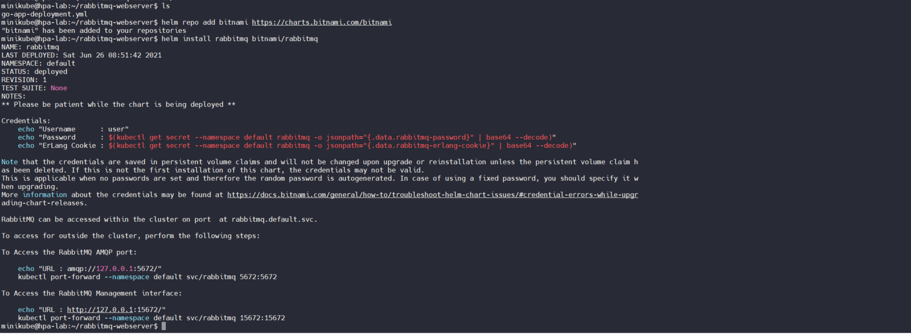

Install `RabbitMQ-exporter` via `Helm`
- (*Optional*) Add repo

```bash
$ helm repo add prometheus-community https://prometheus-community.github.io/helm-charts

$ helm repo update
```

- Configure `values.yaml`:

```yaml
rabbitmq:
  url: http://rabbitmq:15672
  user: user
  password: bitnami
podAnnotations:
    prometheus.io/scrape: "true"
    prometheus.io/path: "/metrics/cluster"
    prometheus.io/port: "9000"
prometheus:
  monitor:
    enabled: true
    additionalLabels:
     release: prometheus
    interval: 15s
```

- Install `exporter`

```bash
$ helm install rabbitmq-exporter prometheus-community/prometheus-rabbitmq-exporter -f values.yaml
```

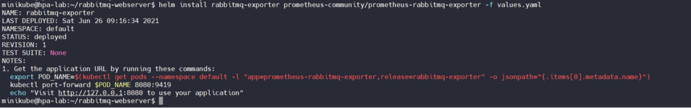

- Verify that `rabbitmq-exporter` has been discovered by `Prometheus` via `Prometheus`'s Dashboard

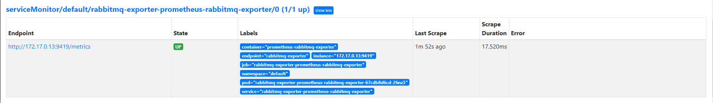

Configure & Accessing `RabbitMQ` Dashboard

- **Note**: *default credentials*
  - **username**: `user` 
  - **password**: `bitnami`

- Expose `RabbitMQ`:

```bash
$ kubectl port-forward --address=0.0.0.0 svc/rabbitmq 15672:15672
```

- Visit dashboard at `http://<IP-of-VM>:15672`
  - Login screen
  
  '

  - **TO-DO**: `Unable to login`
  
  - After being authenticated

  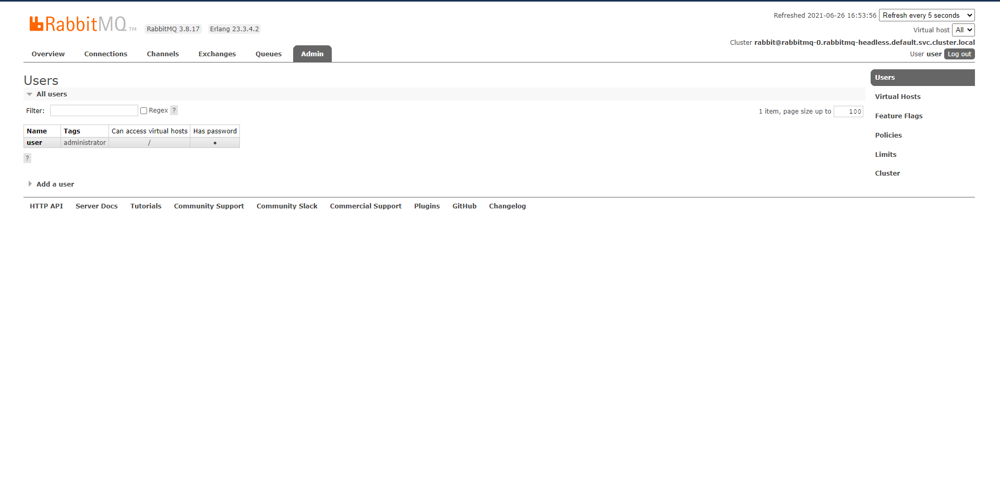

**Before Proceeding**: *ensure that `serviceMonitor` for `Go` application & `RabbitMQ` are available.*

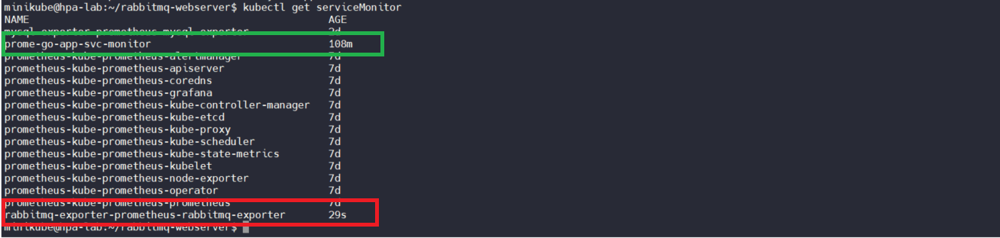

#### `Grafana`

Execute `PromQL` query for metrics display on `Grafana`'s Panel

- Query for `Total Messages in Queue`

```sql
rabbitmq_queue_messages_ready_total
```

- Query for `Total HTTP Requests`

```sql
http_requests_total{container="prome-go-app"}
```

#### Scaling with `KEDA`

Build `ScaledObject` manifest

- Create `.yaml` manifest

```yaml
$ vi rabbitmq-go-scaled-object.yml

---
apiVersion: keda.sh/v1alpha1
kind: ScaledObject
metadata:
  name: rabbitmq-go-alpine-scaledobject
  namespace: default
spec:
  scaleTargetRef:
    name: lab-2-alpine-dummy
  pollingInterval: 10
  cooldownPeriod:  20
  minReplicaCount: 1
  maxReplicaCount: 8
  triggers:
  - type: prometheus
    metadata:
      # Required
      serverAddress: http://prometheus-kube-prometheus-prometheus.default.svc.cluster.local:9090
      metricName: total_ready_messages_queue
      threshold: '3'
      query: rabbitmq_queue_messages_total
  - type: prometheus
    metadata:
      # Required
      serverAddress: http://prometheus-kube-prometheus-prometheus.default.svc.cluster.local:9090
      metricName: total_http_requests
      threshold: '15'
      query: http_requests_total{container="prome-go-app"}

```

Create on `Kubernetes`

```bash
$ kubectl apply -f <path>/rabbitmq-go-scaled-object.yml
```

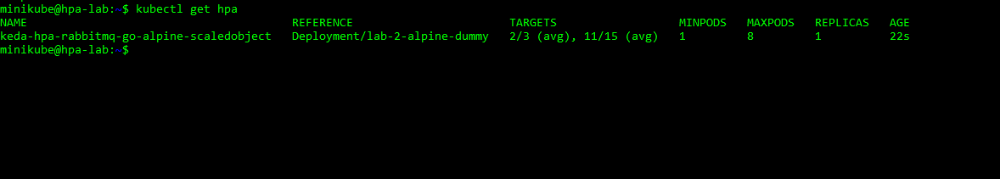

#### Simulate Scailing  

**Generate `http` request automatically**

*Use benchmark tool to perform stress-test*

- Retrieve `URL` of `Go` application

```bash
$ minikube service prome-go-app-service  --url
```

- Execute `5` requests

```bash
$ ab -c 10 -n 5 -r http://192.168.49.2:32629/
```

**Publish `Message` to `Queue` on `RabbitMQ`**

*All operations can be executed via `RabbitMQ` Dashboard*

- Create a sample `Queue` for usage

- Create sample `Messages` for usage

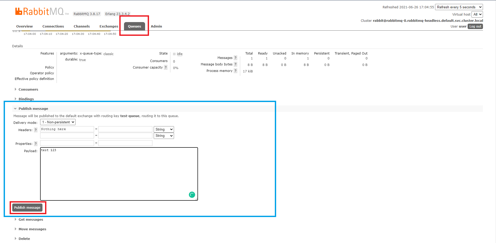

### :heavy_check_mark: Expected Outcomes

#### **Pre-simulation**

*Selected metrics acquire below values*

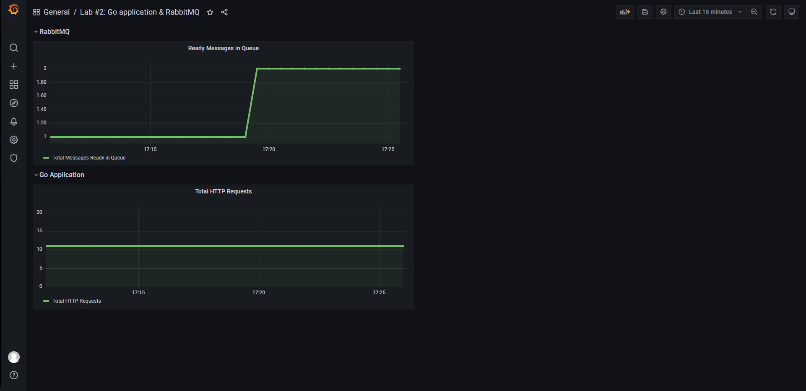

#### **Simulation**

**`Horizontal Pod Autoscaler` is activated**

```bash
$ kubectl get hpa
```

- `Stress-test` runs

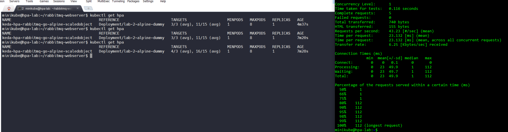


- Number of Pods **Scales up**
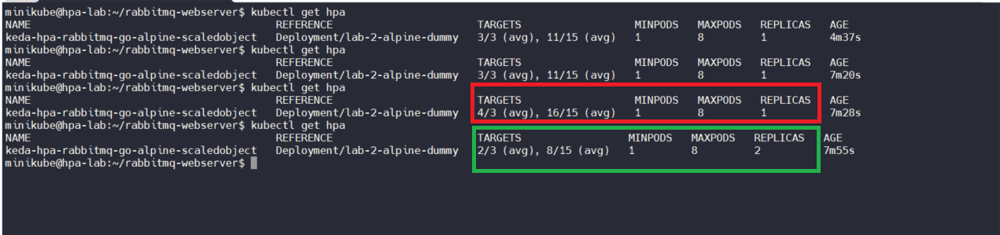

#### `Grafana` Dashboard

- Increases in total `Ready Messages` & `HTTP Requests`

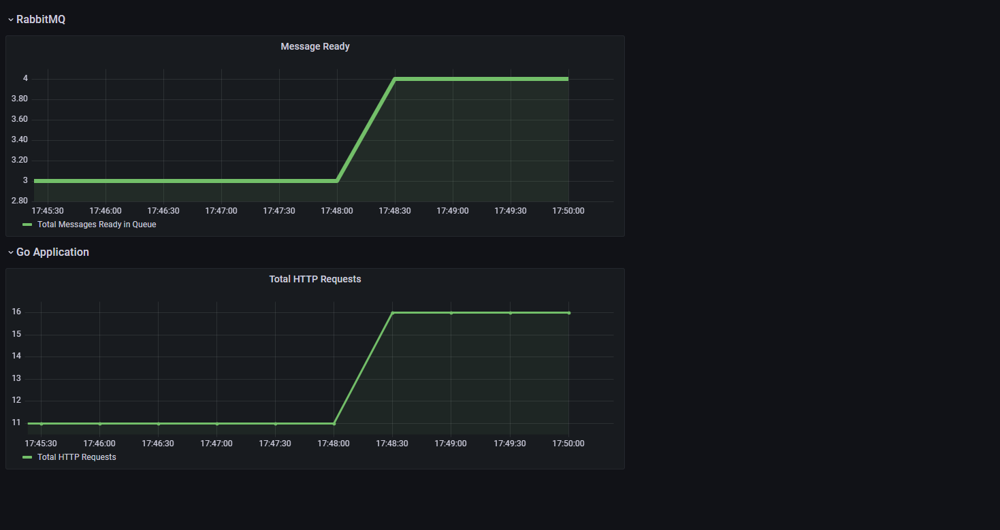

- Number of `Pod` increases

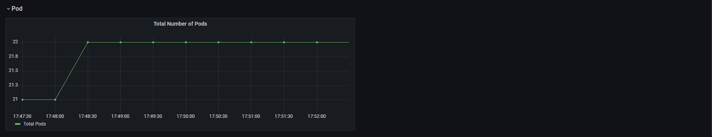