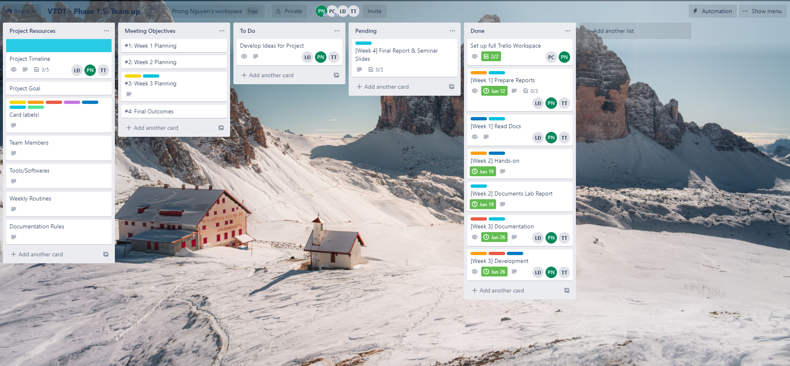

# `Viettel Digital Talent` :two::zero::two::one: 

### Phase 1B: *Team Project*

---

<h1 align="center"> Project Proposal </h1>

## :bulb: Topic: *`Auto-scaling application using custom metrics on Kubernetes`*

### Team :four: - *with following members*:

**Mentor**: Pham Chien

**Mentees**:

- Julian P. Nguyen (Phong D. Nguyen)
- Luong D. Tran 
- Thang V. Tran

<h2 align="center">
 <g-emoji class="g-emoji" alias="date" fallback-src="https://github.githubassets.com/images/icons/emoji/unicode/1f4c5.png">📅</g-emoji>
 Expected Schedule
</h2>

**Week 1**: *Research & set up workspace*

**Date:** *June 7th, 2021 - June 12th, 2021*

**Goal**: Understand implemented concepts

- Collect & reading docs/articles
- Set up `Trello` workspace

**Week 2**: *Basic Implementation*

**Date:** *June 13th, 2021 - June 20th, 2021*

**Goal**: Bring acquired knowledge into actions. Able to configure & apply involved components at elementary level

- Basic install of components
- Perform simple demos to understand the workflow & configurations of components.

**Week 3**: *Enhanced Development*

**Date:** *June 21st, 2021 - June 27th, 2021*

**Goal**: Deployments of `Autoscaling` at elevated level, able to solve real-world use cases.

- Brainstorm which real-world problem to solve
- Simulate the specific use cases & perform labs.

**Week 4**: *Final Report & Presentation Slides*

**Date:** *June 28th, 2021 - July 1st, 2021*

**Goal**: Prepare for Seminar

- Finish & elaborate documentations
- Build Final Report & `Powerpoint` slides

<h2 align="center">
 <g-emoji class="g-emoji" alias="fire" fallback-src="https://github.githubassets.com/images/icons/emoji/unicode/1f525.png">🔥</g-emoji>
 General Objectives 
</h2>

1. Comprehend & analyze **to-implement & related** topics. 

2. Synthesize & aply acquired knowledge through different lab scenerios. 

3. Implement project management methodology & standardize workflow. 

<h2 align="center"> 
    <g-emoji class="g-emoji" alias="hammer_and_wrench" fallback-src="https://github.githubassets.com/images/icons/emoji/unicode/1f6e0.png">🛠️</g-emoji> 
    Covered Concepts 
</h2>

### General 

The project revolves around **`Kubernetes`** - *the Container Orchestration Application*. In [Week 4](https://github.com/vietstacker/Viettel-Digital-Talent-Program-2021/tree/main/Phase-1-Practices/Week-4) of training program, we discussed the basics of this platform. 

**Team 4** holds expectation to leverage what we already learned about **`Kubernetes`** with more advanced ideas & implementations. Besides the mentioned platform, other tools/ideas involve would be taken into consideration.

### :books: Knowledge Requirements

**Kubernetes**

- Understand some fundamental topics/operations of `Kubernetes`
- Simple workflow
- Able to use `Kubernetes`'s CLI - `kubectl`

**System Administration** 

- `Operating System` 
- `Networking`
- `Containerization` *(better to know some `Docker`)*

**Progamming**: *a bit of coding involves while performing labs. Moreover, we may need to be able to debug/understand (some parts) sourcecode of the integrated frameworks/libraries/add-ons*


### Deployment Required Components

As directed by our mentor, the hands-on of this project should contain below components: 

- **Kubernetes**: *installed Cluster should be integrated with these components*

<p align="center">
    
</p>

- **Others**: `KEDA`, `Prometheus & Grafana`

<p align="center">
    
    &nbsp; &nbsp; &nbsp; &nbsp; &nbsp; &nbsp;
    
</p>

#### :book: To-read Concepts

> Here is a suggested to-read list from our team. Further topics may arise during progression. 

#### :ferris_wheel: **Kubernetes**

**Basic**

- Revise Architecture Model
- Built-in Objects
- HELM
...

**Advanced**

- Custom Resource (CR) & CRD
- Kubernetes Operator
- **Horizontal Pod Autoscaler**
- Metrics Pipeline & Monitoring Pipelines
...

**Add-ons**

- `KEDA` - *Kubernetes Event-driven Autoscaling*

- **`Helm` charts**:
    - `kube-state-metrics`
    - `prometheus-mysql-exporter`
    - `prometheus-mongodb-exporter`
    - `kube-prometheus-stack`
...

#### :thermometer: **Observability & Monitoring**

**Prometheus**

- Understand following points:
    - Architecture
    - Features: `Service Discovery`, `Target`
    - (Metrics Scraping/Fetching) Workflow

- Perform query with `PromQL`.

**Grafana**

- Basic usage:
    - Connecting to `Prometheus`
    - Visualize metrics

#### **Additional**

- **RabbitMQ**

- **MySQL** 

- **MongoDB**

```
With additional topics, we would recommend to resolve following questions:

1. What is it? What are prominent features?
2. When to use it? Which use cases?
3. How to use it? How to install/configure?s
```

<h2 align="center"> 
    <g-emoji class="g-emoji" alias="bookmark_tabs" fallback-src="https://github.githubassets.com/images/icons/emoji/unicode/1f4d1.png">📑</g-emoji>
    Project Management
</h2>

#### Used Platforms/Tools

:telephone: **Communication platform**: **`Telegram`**

:page_with_curl: **Version control system** : **`GitHub`**

:open_file_folder: **Project Management Tool**: **`Trello`**



### How we manage project?

**Management Key Idea**

```bash
As each person has his/her own perceptions on each topics, we strongly encourage members to work on the same number of topics and share his/her approaches with others through weekly discussions.
```

**How do we work on planning?**

Details of things to work on a new week would be discussed on weekend of previous week.

**How use `Trello`?**

We will get things get updated on `Trello` before the start of a new week. Each task/issue is represented under a card on `Trello` board. 

Members use `Trello` to track progress & review the description/guidances for each task/other pre-defined requirements.

**How do we assign tasks to members?**

All members receive the **same number** of topics to work on. Please note that all topics are *similar*.  

**Why we dont assign specific topics to each individual?**

We expect that all mentees should reach some level of understanding on core topics (**HPA, KEDA, Prometheus**). Everyone should execute research/lab & write reports on all topics. 

#### Weekly Routines

- **Report Deadline**: `Friday/Saturday`
- **Scheduled Meetings**: `Saturday/Sunday`
- **Urgent Meetings**: `Any weekday`

<h2 align="center"> 
    
    GitHub Repository
</h2>

### :deciduous_tree: Directory Structuring

*This Reposiory stores reports from our team members. If you want to have a closer look at our works, please visit each reports for further details*

#### **Structural Overview of Repository**

3 main folders, from `Week 1` --> `Week 3`. On each week, each mentee has personal folder to submit report.

**Reports Content Summary**

- **Week 1**: Summary notes on topics that each individual collects/reads on Week 1. 

- **Week 2**: *Documentation on* 
    - Installation of `HPA`, `KEDA`, `Prometheus`.
    - Integrations of:
        - Plain `HPA` with `Kubernetes`
        - All 3 listed modules with `Kubernetes` 

- **Week 3**: Reports on conducting simulation of real-world use cases. 
    - Extracting metrics from various sources (**e.g**: from running node & `RabbitMQ`)
    - Multiple metrics based scaling

#### **Structure Diagram**

```bash
│   LICENSE
│   README.md
│
├───imgs
│
├───Week 1
│   ├───Julian-P-Nguyen
│   │   │   README.md           # Notes on          
│   │   │
│   │   └───imgs
│   │      
│   │
│   ├───Tran-Duc-Luong
│   │   │   Report-KEDA-Kubernetes.md
│   │   └───img
│   └───Tran-Van-Thang
│           hpa-keda-prometheus.md
│
├───Week 2
│   ├───Julian-P-Nguyen
│   │   │   README.md  
│   │   │
│   │   └───imgs
│   │
│   ├───Tran-Duc-Luong
│   │   │   Autoscale.md
│   │   │
│   │   └───image
│   │
│   └───Tran-Van-Thang
│       │   HPA-sử dụng CPU metrics.md
│       │   KEDA-Prometheus sử dụng exporter.md
│       │   KEDA-Prometheus sử dụng servicemonitor.md
│       │
│       └───img
│
└───Week 3
    ├───Julian-P-Nguyen
    │   │   README.md
    │   │
    │   └───imgs
    │
    ├───Tran-Duc-Luong
    └───Tran-Van-Thang
        │   webapi+rabbitmq.md
        │
        └───img

```

**Closer View on Paths**

**`/Week 1`**: Research

All files hold members' notes on 3 core topics & some other related concetps of this project, including but not limited to: 

- `KEDA`
- `Prometheus`
- `Horizontal Pod Autoscaler` (HPA)

...

**`/Week 2`**: Basic Implementations

- `/Julian-P-Nguyen`:
    -  `/README.md`: *Following deployments are carried out* 
        - Scale a simple `PHP-Apache` application with plain `HPA` by CPU metric
        - Scale by a custom metric from `MySQL` via `mysql-exporter`. 

- `/Tran-Duc-Luong`:
    -  `/Autoscale.md`: Build & scale a `NodeJS webserver` exposing metrics by itself. 

- `/Tran-Van-Thang`:
    -  `/HPA-sử dụng CPU metrics.md`: Implement plain `HPA` to autoscale sample `webserver`.
    - `/KEDA-Prometheus sử dụng exporter.md`: Scale by a custom metric from `MongoDB` via `mongodb-exporter`. 
    - `/KEDA-Prometheus sử dụng servicemonitor.md`: Scale a `Go webserver` with metrics endpoints.


**`/Week 3`**: Simulation of real-world use cases
- `/Julian-P-Nguyen`:
    - `/README.md`: *2 scenarios taken into demos. 
        - Lab #1: Scaling application (`BitnamiWordPress` & `Bitnami MariaDB`) by 2 system metrics (**CPU** & **Memory** usage)
        - Lab #2: Scaling by serivce metrics from 2 different applications, a `Go Webserver` & `RabbiMQ`.
- `/Tran-Van-Thang`:
    - `/webapi+rabbitmq.md`: Scaling by custom metrics from 2 different applications, a `Go Webserver` & `RabbiMQ`.

- `/Tran-Duc-Luong`

### :construction_worker: Contributors

- [**Julian P. Nguyen**](https://github.com/meobilivang)
- [**Luong D. Tran**](https://github.com/ducluongtrann)
- [**Thang V. Tran**](https://github.com/tranthang2404)