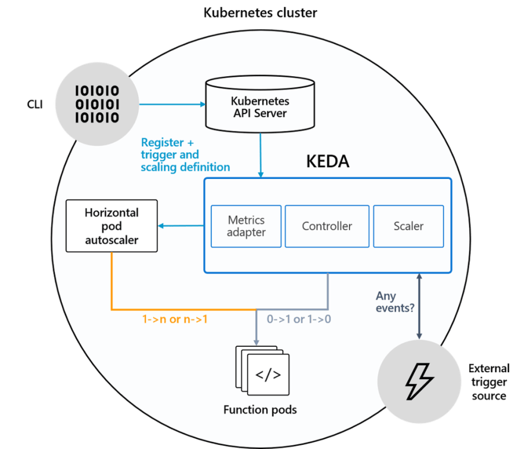
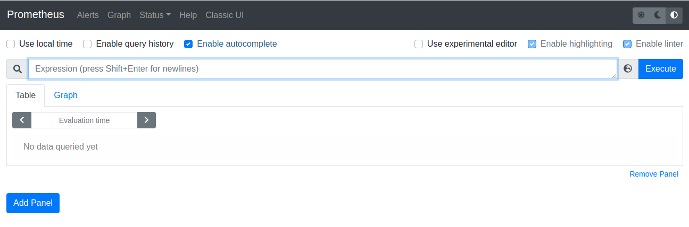
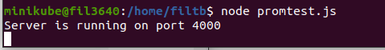
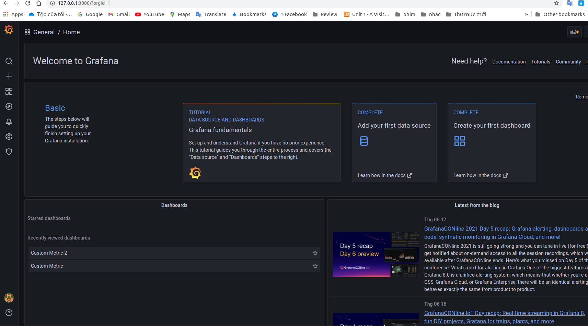
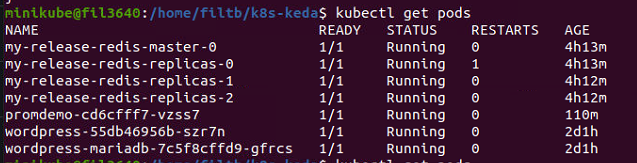
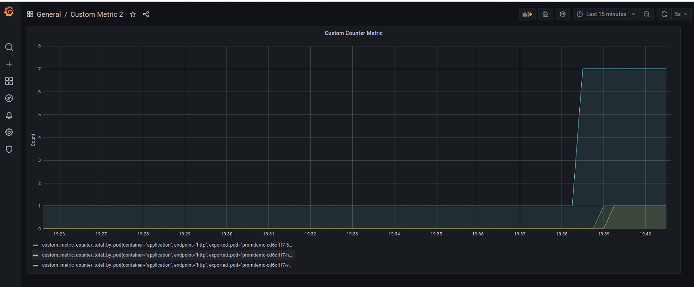
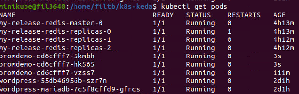
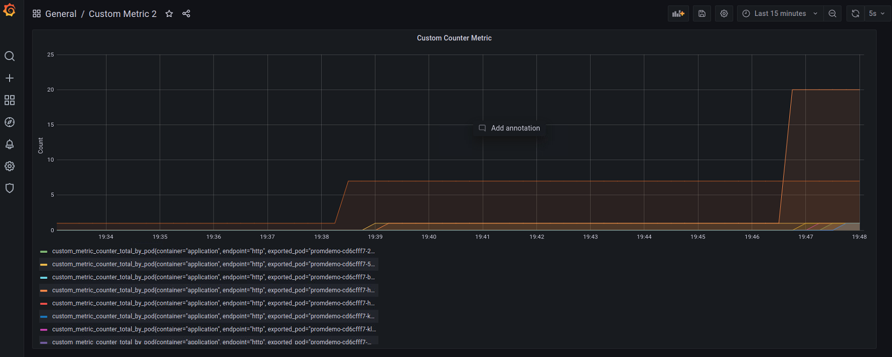
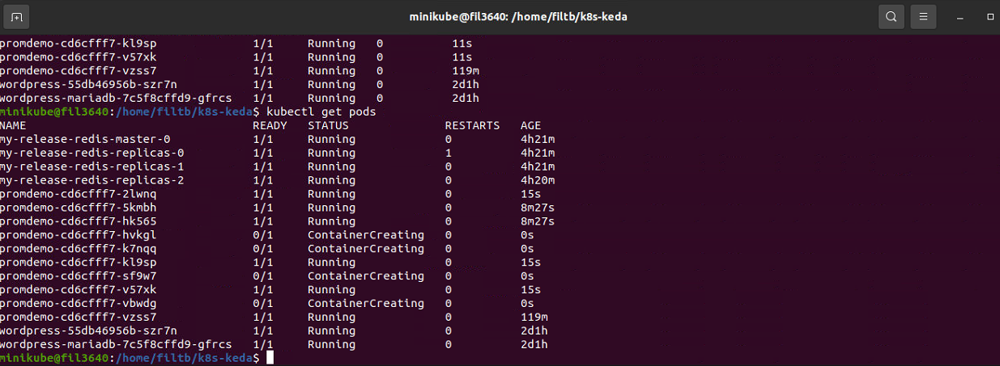

# Autoscaling trong Kubernetes sử dụng KEDA và Prometheus

- [Autoscaling trong Kubernetes sử dụng KEDA và Prometheus](#autoscaling-trong-kubernetes-sử-dụng-keda-và-prometheus)
  - [Tóm tắt](#tóm-tắt)
  - [Các phần Setup](#các-phần-setup)
    - [1. Cài đặt KEDA](#1-cài-đặt-keda)
    - [1. Cài đặt Prometheus và Grafana](#1-cài-đặt-prometheus-và-grafana)
  - [Viết các file manifest để deploy](#viết-các-file-manifest-để-deploy)
    - [1. Application](#1-application)
    - [2. Manifest để deploy App](#2-manifest-để-deploy-app)
    - [3. ServiceMonitor manifest](#3-servicemonitor-manifest)
    - [4. ScaleObject](#4-scaleobject)
  - [Deploy](#deploy)
  - [Test](#test)

## Tóm tắt

Trong các phần trước ta đã đề cập về Project, các định nghĩa, ứng dụng và cách setup của KEDA, Prometheus, HPA...

Trong phần này, ta sẽ thực hành scale application deployment về  NodeJS/ Express app dựa tren custom metric được thu thập bởi Prometheus thông qua KEDA



## Các phần Setup

Cần cài một số mục:
- Application (deployment) để exposes ra custom metric 
- Prometheus (bao gồm Grafana để hiển thị metric qua đồ thị) và Prometheus Service Monitor để lấy metrics endpoint của application.
- KEDA

### 1. Cài đặt KEDA
Để cài KEDA trên K8s cluster chúng ta sử dụng Helm

```console
helm repo add kedacore https://kedacore.github.io/charts
helm repo update
kubectl create namespace keda
helm install keda kedacore/keda --namespace keda
```

### 1. Cài đặt Prometheus và Grafana

- Clone "kebe-prometheus" từ (<https://github.com/prometheus-operator/kube-prometheus>)

- Từ repo vừa tải về ta setup Prometheus và Grafana qua các lệnh

```console
kubectl apply -f manifests/setup
kubectl apply -f manifests/
```

- Ta có thể kiểm tra kết quả bằng cách truy cập vào Prometheus Web UI and Grafana bằng cách forwarding port của services tới local host

```console
kubectl --namespace monitoring port-forward svc/prometheus-k8s 9090
Forwarding from 127.0.0.1:9090 -> 9090
Forwarding from [::1]:9090 -> 9090
```


và truy cập Grafana với username và password mặc định là ```admin/admin```

```console
kubectl --namespace monitoring port-forward svc/grafana 3000
Forwarding from 127.0.0.1:3000 -> 3000
Forwarding from [::1]:3000 -> 3000
```


## Viết các file manifest để deploy

### 1. Application

Ở đây chúng ta sẽ dploy một code NodeJS đơn giản cung cấp 1 endpoint. Nếu requests tới endpoint, bộ đếm sẽ set giá trị cộng lên. Sau đó app này sẽ tương tác với Prometheus qua prom-client từ đó cung cấp metrics endpoint.

- File code NodeJS ```promtest```

```js
const express = require("express");
const os = require("os");
const app = express();
const apiMetrics = require("prometheus-api-metrics");
app.use(apiMetrics());
app.use(express.json());
 
const client = require("prom-client");
 
// Create Prometheus Gauge metric
const gauge = new client.Gauge({
  name: "custom_metric_counter_total_by_pod",
  help: "Custom metric: Count per Pod",
  labelNames: ["pod"],
});
 
app.post("/api/count", (req, res) => {
  // Set metric to count value...and label to "pod name" (hostname)
  gauge.set({ pod: os.hostname }, req.body.count);
  res.status(200).send("Counter at: " + req.body.count);
});
 
app.listen(4000, () => {
  console.log("Server is running on port 4000");
  // initialize gauge
  gauge.set({ pod: os.hostname }, 1);
});
```
> Counter
> Gauge
> Histogram
> Summary

### 2. Manifest để deploy App

```yaml
apiVersion: apps/v1 
kind: Deployment
metadata:
  name: promdemo 
  labels:
    application: promtest
    service: api
spec:
  replicas: 1
  strategy:
    type: RollingUpdate
    rollingUpdate:
      maxSurge: 1
      maxUnavailable: 1
  minReadySeconds: 5
  revisionHistoryLimit: 3
  selector:
    matchLabels:
      application: promtest
      service: api
  template:
    metadata:
      labels:
        application: promtest
        service: api
    spec:
      automountServiceAccountToken: false
      containers:
        - name: application
          resources:
            requests:
              memory: "64Mi"
              cpu: "100m"
            limits:
              memory: "256Mi"
              cpu: "500m"
          image: csaocpger/expressmonitoring:4.3
          imagePullPolicy: IfNotPresent
          ports:
          - containerPort: 4000
---
apiVersion: v1
kind: Service
metadata:
  name: promdemo
  labels:
    application: promtest
spec:
  ports:
  - name: http
    port: 4000
    targetPort: 4000
  selector:
    application: promtest
    service: api
  type: LoadBalancer

```

### 3. ServiceMonitor manifest

ServiceMonitor cho phép Prometheus có thể tìm thấy service ```promtest```

```yaml
kind: ServiceMonitor
apiVersion: monitoring.coreos.com/v1
metadata:
  name: promtest
  labels:
    application: promtest
spec:
  selector:
    matchLabels:
      application: promtest
  endpoints: 
  - port: http
```
### 4. ScaleObject

Phần quan trọng nhất để chúng ta có thể sclae application bằng KEDA là viết file manifest cho ScaleObject. Nó sẽ giúp chúng ta kết nối mectrics collector và Kebernetes HPA.

```yaml
apiVersion: keda.k8s.io/v1alpha1
kind: ScaledObject
metadata:
  name: prometheus-scaledobject
  namespace: default
spec:
  scaleTargetRef:
    deploymentName: promdemo
  triggers:
  - type: prometheus
    metadata:
      serverAddress: http://127.0.0.1:9090
      metricName: custom_metric_counter_total_by_pod
      threshold: '3'
      query: sum(custom_metric_counter_total_by_pod{namespace!="",pod!=""})
```
> Chú ý ở đây ta thấy không có thông số về minReplicaCout và maxReplicaCount vì đang không để hạn chế. Nếu có ta thêm dòng sau vào mục sclaeTargerRef:
> minReplicaCount: <n> 
> maxReplicaCount: <m>

## Deploy

1. Chạy file NodeJS

Chú ý trước khi chạy file này chúng ta phải cài NodeJS và các thứ viện cần thiết cho nó qua ```npm``` (Trong lúc cài đặt đã mắc một vài lỗi, nhưng đã fix và quên không chụp lại vì sao :)) )
Sau khi cài đặt xong các module cần thiết ta chạy:

```console
node promtest.js
```


2. Chạy các file manifest

```console
kubectl apply -f prom-deloy.yaml
kubectl apply -f keda-scaledobject.yaml
```
Sau đó ta truy cập lại vào các trang prometheus UI và Grafana để xem kết quả:
> Khi vào trong Grafana ta phải import file grafana dashboard để xem



## Test

- Để test scale ta tăng số lượng request bằng câu lệnh:

```console
curl --location --request POST 'http://<EXTERNAL_IP_OF_SERVICE>:4000/api/count' \
--header 'Content-Type: application/json' \
--data-raw '{
    "count": 7
}'
```
- Ta thấy các kết quả:

request = 7







request = 20



- Để có thể xem được kết quả thay đổi liên tục của các pod đang scale ta cài thêm gói:
... 
