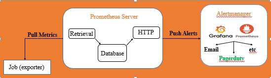
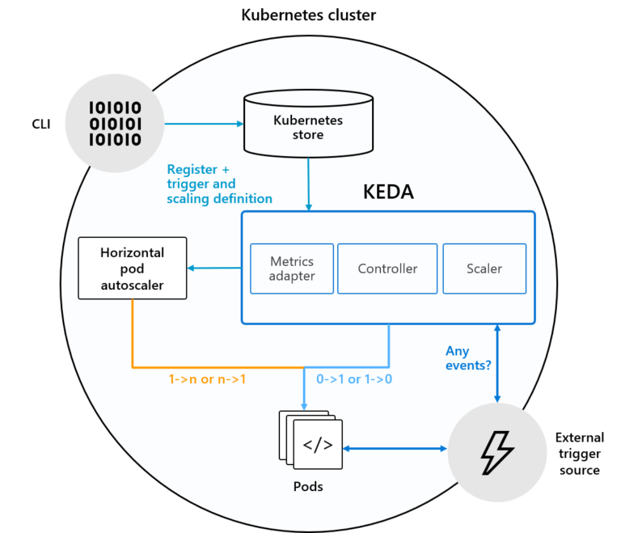
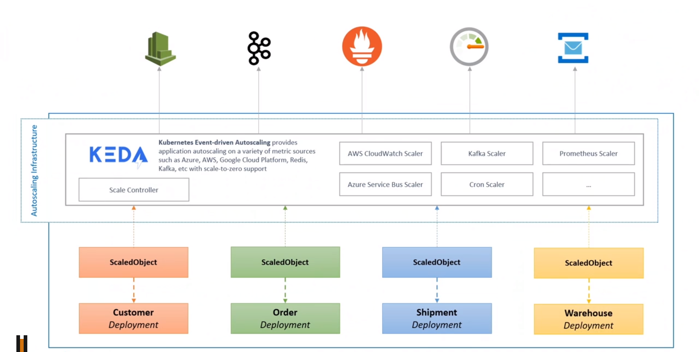

# KEDA-Prometheous-Kubernetes

- [KEDA-Prometheous-Kubernetes](#keda-prometheous-kubernetes)
  - [Định nghĩa và cơ chế](#định-nghĩa-và-cơ-chế)
    - [**1. Horizontal Pod Autoscaler**](#1-horizontal-pod-autoscaler)
    - [**2. Prometheus**](#2-prometheus)
    - [**3. KEDA - Kubernetes-based event-driven autoscaling**](#3-keda---kubernetes-based-event-driven-autoscaling)
  - [Tài liệu tham khảo](#tài-liệu-tham-khảo)

## Định nghĩa và cơ chế

### **1. Horizontal Pod Autoscaler**

Horizontal Pod Autoscaler tự động scales số Pods trong replication controller, deployment, replica set or stateful set dựa trên các thông số metrics(Các thông số về resource như CPU, Mem... hoặc từ [custom metrics](https://github.com/kubernetes/community/blob/master/contributors/design-proposals/instrumentation/custom-metrics-api.md))
HPA được triển khai dưới dạng Kubernetes API resource và controller. Controller sẽ định kỳ điều chỉnh số lượng replicas để phù hợp với mức sử dụng tài nguyên.

- HPA được triển khai theo chu kỳ lặp, mặc định 15s
- Trong bài này để kích hoạt HPA dựa trên các custom matrics, external matrics sẽ được lấy dưới dạng objects để scale target thông qua HPA.

### **2. Prometheus**

- Prometheus là một công cụ monitor server mã nguồn mở với cơ sở dữ liệu theo thời gian thực (An opensource  time series database).
- Time series database là những database được lưu trữ theo các mốc thời gian. Nghĩa là mỗi dữ liệu luôn được gắn với một mốc thời gian nhất đinh từ đó tạo thành chuỗi dữ liêu theo thời gian từ đó giúp chúng ta có thể xem lại dữ liệu cho một khoảng thời gian 1 giờ hay 1 tiếng.
- Prometheus thực hiện quá trình kéo (pull) các thông số/số liệu (metric) từ các job (exporter). Sau đấy Prometheus sẽ lưu trữ các dữ liệu thu thập được ở local máy chủ. Tiếp đến sẽ chạy các rule để xử lý các dữ liệu theo nhu cầu cũng như kiểm tra thực hiện các cảnh báo mà bạn mong muốn.

- Các service thì thường không thể tự export được các metrics cho Prometheus mà cần đến các Instructmentation/Exporter. *(Exporter là những app được viết cho mấy cái thông dụng như Database, Server. Chúng ta chỉ cần chạy nó và nó sẽ export các metrics thu thập được cho mình.)*. Prometheus: chính bản thân prometheus cũng có một built-in exporter, export các metrics về service prometheus ra tại URI: http://prometheus.lc:9090/metrics

**Cài đặt:**

<https://vnpro.vn/thu-vien/monitoring-with-prometheus-3652.html>

<https://viblo.asia/p/gioi-thieu-ve-prometheus-cong-cu-monitoring-hieu-qua-Ljy5VYzblra>

### **3. KEDA - Kubernetes-based event-driven autoscaling**

- KEDA giúp chúng ta scaling các container trong Kubernetes dựa trên số lượng events. KEDA cung cấp hạ tầng giúp dễ dàng scale applications. KEDA có thể scale app về O instances nếu không có tiến trình làm việc.
- KEDA là cơ chế lightweight và có thể được thêm vào bất cứ cụm Kebernetes nào. KEDA có thể mở rộng chức năng và không phải ghi đè hay nhân bản lên.
- KEDA sử dụng Horizontal Pod Autoscaler (HPA) trong Kubernetes.
- Sử dụng ScaleObject để định nghĩa scalling rules cho application.

## Tài liệu tham khảo
- <https://keda.sh/>
- <https://helpex.vn/article/tu-dong-dinh-muc-dich-vu-kubernetes-microservice-cua-ban-voi-keda-609646642b25ab9c2d9277a4>
- <https://channel9.msdn.com/Shows/Azure-Friday/Autoscale-applications-on-Kubernetes-with-Kubernetes-Event-Driven-Autoscaling-KEDA>
- <https://github.com/krvarma/event-driven-autoscaling-using-keda>
- <https://www.codit.eu/blog/exploring-kubernetes-based-event-driven-autoscaling-keda/?country_sel=be>