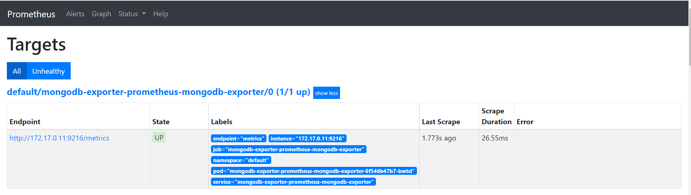
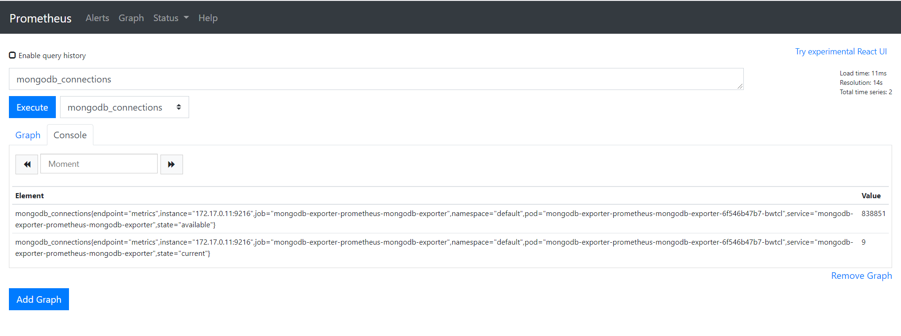
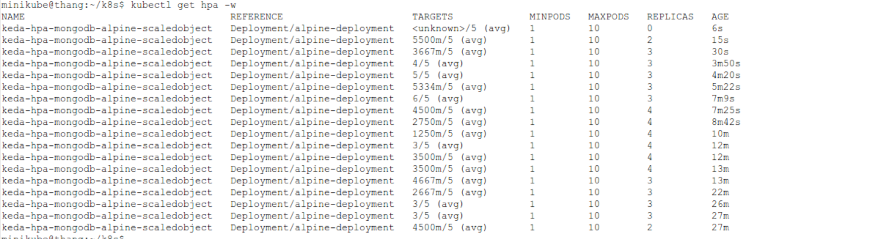

# Triển khai auto scaled với KEDA, Prometheus

## 1. Cài đặt môi trường

### A. Cài đặt helm

helm giống như một package manager cho k8s, giống npm của nodejs.

```console
curl -fsSL -o get_helm.sh https://raw.githubusercontent.com/helm/helm/master/scripts/get-helm-3
chmod 700 get_helm.sh
./get_helm.sh
```

### B. Cài đặt prometheus sử dụng helm

- Thêm repo cho helm

```console
helm repo add prometheus-community https://prometheus-community.github.io/helm-charts
helm repo update
```

- Cài đặt prometheus

```console
helm install prometheus prometheus-community/kube-prometheus-stack
```

### C. Sử dụng Prometheus, Grafana

> Sử dụng cơ chế port-forward để truy cập giao diện của prometheus và grafana

```console
kubectl port-forward --address 0.0.0.0 tên-pod số-hiệu-cổng
```

> Ví dụ mình muốn truy cập UI của prometheus

```console
kubectl port-forward --address 0.0.0.0 prometheus-prometheus-prometheus-oper-prometheus-0 9090
```

> Trong đó `prometheus-prometheus-prometheus-oper-prometheus-0` là tên pod prometheus khi triển khai trên máy mình.

> grafana sẽ có port là 3000

### D. Cài đặt keda sử dụng helm

- Thêm repo cho helm

```console
helm repo add kedacore https://kedacore.github.io/charts
helm repo update
```

- Cài đặt keda

```console
kubectl create namespace keda
helm install keda kedacore/keda --version 2.0.0 --namespace keda
```

## 2. Triển khai thử nghiệm

### A. Mô tả bài thử nghiệm

> Mình sẽ triển khai một database `mongodb` và dựa vào `số lượng kết nối` đến mongodb để scaled pod trong deployment mong muốn (deployment này sử dụng image là `alpine` - một minimal image docker).

Sơ đồ của việc triển khai:

```console

mongodb   <---- mongodb-exporter  <---- prometheus <---- keda   ---> scaled pod

```

- Ta cần sử dụng `mongodb-exporter` để lấy metrics từ `mongodb`, sau đó chuẩn hóa dữ liệu giúp `prometheus` hiểu và lấy được metrics định kỳ (`mongodb-exporter` giúp tạo ra một `servicemonitor` giúp `prometheus` nhận ra và lấy metrics).

### B. Triển khai

#### b1. Triển khai mongodb

```console
apiVersion: apps/v1
kind: Deployment
metadata:
  name: mongodb-deployment
  labels:
    app: mongodb
spec:
  replicas: 1
  selector:
    matchLabels:
      app: mongodb
  template:
    metadata:
      labels:
        app: mongodb
    spec:
      containers:
      - name: mongodb
        image: mongo
        ports:
        - containerPort: 27017
---
apiVersion: v1
kind: Service
metadata:
  name: mongodb-service
spec:
  selector:
    app: mongodb
  ports:
    - protocol: TCP
      port: 27017
      targetPort: 27017
```

#### b2. Triển khai mongodb-exporter

> Tạo một file `values.yaml` có nội dung sau:

```console
mongodb:
  uri: "mongodb://mongodb-service:27017"

serviceMonitor:
  additionalLabels:
    release: prometheus
```

> Cài đặt mongodb-exporter kết nối với mongodb service đã triển khai ở trên (sử dụng tham số `-f values.yaml` giúp exporter kết nối được với service mongodb, bên cạnh đó nó có `release: prometheus` giúp prometheus biết được đây là một target endpoint):

```console
helm install mongodb-exporter prometheus-community/prometheus-mongodb-exporter -f values.yaml
```

> Lúc này khi truy cập `http://localhost:9090/targets`sẽ thấy một enpoint mới của mongodb.



> Truy cập `http://localhost:9090/graph` để query metrics. Ở đây mình sẽ lấy `mongodb_connections`, thông số này sẽ được mình sử dụng để scaled ở phần sau.



> Kết quả hiển thị số lượng kết nối hiện tại là 9

#### b3. Triển khai một deloyment làm mục tiêu để scale

> deployment này chỉ tạo ra 2 pod của image alpine, không có mục đích nào khác

```console
apiVersion: apps/v1
kind: Deployment
metadata:
  name: alpine-deployment
spec:
  selector:
    matchLabels:
      app: alpine
  replicas: 2
  template:
    metadata:
      labels:
        app: alpine
    spec:
      containers:
      - name: alpine
        image: alpine
        command:
        - /bin/sh
        - -c
        - "while true; do sleep 30; done"
        resources:
          limits:
            memory: "128Mi"
            cpu: "100m"
```

#### b4.Triển khai ScaledObject sử dụng keda

```console
apiVersion: keda.sh/v1alpha1
kind: ScaledObject
metadata:
  name: mongodb-alpine-scaledobject
  namespace: default
  labels:
    name: alpine-deployment
spec:
  scaleTargetRef:
    name: alpine-deployment
  pollingInterval: 15  # Optional. Default: 30 seconds
  cooldownPeriod:  30 # Optional. Default: 300 seconds
  minReplicaCount: 1   # Optional. Default: 0
  maxReplicaCount: 10 # Optional. Default: 100
  triggers:
  - type: prometheus
    metadata:
      serverAddress: http://prometheus-prometheus-oper-prometheus.default.svc.cluster.local:9090
      metricName: mongodb_connections
      threshold: '5'
      query: mongodb_connections{state="current"}
```

> Mình sẽ viết một `ScaledObject` giúp auto scaled số lượng pod của deployment `alpine-deployment` đã triển khai ở mục `b3`.

- Dựa vào query `mongodb_connections{state="current"}` thì keda sẽ lấy được lượng kết nối hiện tại.
- Sau đó so với ngưỡng là 5 (`threshold: '5'`) để ra quyết định scaled.
- Số lượng pod được scaled từ 1 -> 10.
- Scaler là prometheus (`type: prometheus`)
- địa chỉ của prometheus server là `http://prometheus-prometheus-oper-prometheus.default.svc.cluster.local:9090` trong đó host là tên service của prometheus.

### C. Kết quả

Sau khi triển khai tất cả các thành phần trên ta có kết quả như sau:


