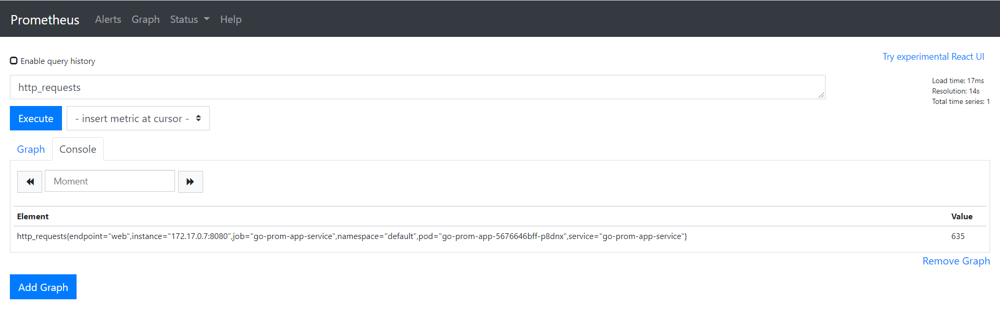

# Triển khai KEDA, Prometheus sử dụng service monitor

> Đọc bài `KEDA-Prometheus sử dụng exporter` trước khi làm bài này.
> Bài này thực hiện tương tự như bài`KEDA-Prometheus sử dụng exporter` nhưng thay vì phải sử dụng exporter có sẵn thì ta sẽ tự viết service monitor để lấy metrics từ web server chúng ta tự code.

- Triển khai một web-server đã tích hợp sẵn enpoint /metrics ở trong code

```console
apiVersion: apps/v1
kind: Deployment
metadata:
  name: go-prom-app
spec:
  replicas: 1
  selector:
    matchLabels:
      app: go-prom-app
  template:
    metadata:
      labels:
        app: go-prom-app
    spec:
      containers:
      - name: go-prom-app
        image: abhirockzz/go-prom-app
        env:
          - name: REDIS_HOST
            value: redis-server-master.default.svc.cluster.local
          - name: REDIS_PORT
            value: "6379"
        imagePullPolicy: Always
        ports:
            - containerPort: 8080
---
apiVersion: v1
kind: Service
metadata:
  name: go-prom-app-service
  labels:
    run: go-prom-app-service
spec:
  ports:
  - name: web
    port: 8080
    protocol: TCP
  selector:
    app: go-prom-app
```

- Sau đó tạo một service monitor như sau:

```console
apiVersion: monitoring.coreos.com/v1
kind: ServiceMonitor
metadata:
  name: go-prom-app-service
  labels:
    release: prometheus
spec:
  selector:
    matchLabels:
       run: go-prom-app-service
  endpoints:
  - port: web
```

> `release: prometheus` giúp prometheus nhận diện và lấy được metric, `run: go-prom-app-service` sẽ match với service `go-prom-app-service`.

Sau khi triển khai tất cả thành công, truy cập trang `http://localhost:9090/targets` ta sẽ thấy 1 endpoint mới tên là `go-prom-app-service`


Query thử metrics là tổng số lượng request



- Triển khai ScaledObject

> Tương tự như bài sử dụng exporter, ta chỉ cần thay đổi tên deployment và thay đổi câu query prometheus.
> Scale dựa vào số request/giây trung bình trong 2 phút
```console
apiVersion: keda.sh/v1alpha1
kind: ScaledObject
metadata:
  name: go-app-scaledobject
  namespace: default
  labels:
    name: go-prom-app
spec:
  scaleTargetRef:
    name: go-prom-app
  pollingInterval: 15  # Optional. Default: 30 seconds
  cooldownPeriod:  30 # Optional. Default: 300 seconds
  minReplicaCount: 1   # Optional. Default: 0
  maxReplicaCount: 10 # Optional. Default: 100
  triggers:
  - type: prometheus
    metadata:
      # Required
      serverAddress: http://prometheus-prometheus-oper-prometheus.default.svc.cluster.local:9090
      metricName: http_requests_avg
      threshold: '2'
      query: sum(rate(http_requests[2m]))
```

> Kết quả theo dõi việc scaled, sau khi `stress test` bằng cách gọi đến enpoint `/test` của web server (web server trên chỉ có 2 api là `/metrics` và `/test`)


