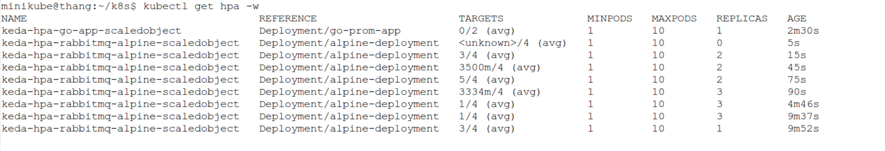
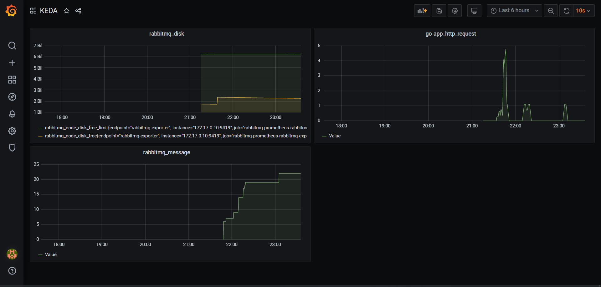

# Triển khai Auto scaled sử dụng nhiều metrics

## A.Cài Đặt

### 1.Cài đặt web api

- Như các bài lab trước mình sẽ sử dụng image `abhirockzz/go-prom-app` được viết bằng `go` và có tích hợp enpoint `/metrics`
- Triển khai một service sử dụng image đó và viết một service monitor giúp prometheus scrap được metrics( chi tiết ở bài lab sử dụng servicemonitor)

### 2.Cài đặt mục tiêu để auto scaled

- Như các bài trước mình sẽ sử dụng image `alpine` để làm mục tiêu scaled
- Service chạy các `alpine` mình đã viết ở bài triển khai sử dụng exporter.

### 3.Cài đặt rabbitmq và rabbitmq exporter

- Tạo một service rabbitmq

```console
apiVersion: apps/v1
kind: Deployment
metadata:
  name: rabbitmq-deployment
  labels:
    app: rabbitmq
spec:
  replicas: 1
  selector:
    matchLabels:
      app: rabbitmq
  template:
    metadata:
      labels:
        app: rabbitmq
    spec:
      containers:
      - name: rabbitmq
        image: bitnami/rabbitmq:latest
        ports:
        - containerPort: 15672
---
apiVersion: v1
kind: Service
metadata:
  name: rabbitmq-service
spec:
  selector:
    app: rabbitmq
  ports:
    - protocol: TCP
      port: 15672
      targetPort: 15672
```

- Triển khai exporter cho rabbitmq

```console
rabbitmq:
  url: http://rabbitmq-service:15672
  user: user
  password: bitnami
prometheus:
  monitor:
    additionalLabels:
      enabled: true
      release: prometheus
    rules:
      enabled: true
      release: prometheus
```

> Nhưng với exporter này, nó vẫn tạo ra pod và service có thể lấy được metrics, nhưng prometheus lại ko tạo ra servicemonitor. Nên ở đây mình sẽ viết thêm một service monitor giúp prometheus lấy metrics thông qua servicemonitor mình viết.

```console
kind: ServiceMonitor
metadata:
  name: rabbitmq-app
  labels:
    release: prometheus
spec:
  selector:
    matchLabels:
      app: prometheus-rabbitmq-exporter
      app.kubernetes.io/managed-by: Helm
      chart: prometheus-rabbitmq-exporter-1.0.0
      heritage: Helm
      release: rabbitmq
  endpoints:
  - port: rabbitmq-exporter
```

> Các trường trong config liên quan đến service của cái exporter rabbitmq (Nhắc lại: Mọi thứ của rabbitmq exporter đều hoạt động trừ việc tạo ra servicemonitor)

## B. Triển khai Auto Scaled

```console
apiVersion: keda.sh/v1alpha1
kind: ScaledObject
metadata:
  name: rabbitmq-alpine-scaledobject
  namespace: default
spec:
  scaleTargetRef:
    name: alpine-deployment
  pollingInterval: 15  # Optional. Default: 30 seconds
  cooldownPeriod:  30 # Optional. Default: 300 seconds
  minReplicaCount: 1   # Optional. Default: 0
  maxReplicaCount: 10 # Optional. Default: 100
  triggers:
  - type: prometheus
    metadata:
      # Required
      serverAddress: http://prometheus-prometheus-oper-prometheus.default.svc.cluster.local:9090
      metricName: rabbitmq_queue_messages_total
      threshold: '4'
      query: rabbitmq_queue_messages_total
  - type: prometheus
    metadata:
      # Required
      serverAddress: http://prometheus-prometheus-oper-prometheus.default.svc.cluster.local:9090
      metricName: http_requests
      threshold: '1'
      query: sum(rate(http_requests[2m]))
```

> Dựa vào số lượng message đang còn trong queue và số lượng request/giây của web server, hệ thống sẽ quyết định scaled.

> Ở đây mình sẽ scaled service có labels`name: alpine-deployment` để tăng số pod chạy `alpine`

## C. Kết quả

- Mình sẽ publish vào queue một số lượng message theo ý muốn, sau đó tạo ra một số lượng request đến web server.
- Lúc đó, `hpa` dựa vào thông số các metrics hiện tại để scaled ứng dụng
- Đây là kết quả theo dõi



> Thông qua việc tăng giảm số lượng message lên queue và việc tăng giảm tần suất request đên server api thì ta thấy việc scaled diễn ra khá thông suốt

> `hpa` sẽ scale vào lượng pod lớn nhất được yêu cầu. Ví dụ:
>    - Số lượng message trên queue: ngưỡng=4, hiện tại=6  => cần 2 pod
>    - Số lượng request/giây lên server: ngưỡng=1, hiện tại=3.5  => cần 4 pod

> Lúc này `hpa` sẽ scaled ứng dụng ở `4` pod


## D. Tạo một màn hình theo dõi metrics


