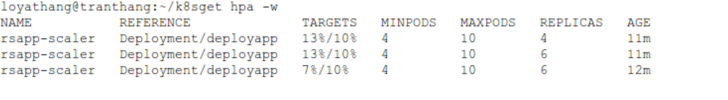

# Triển khai HPA đơn giản

## 1. Cài đặt môi trường

- Đây là bài hướng dẫn triển khai Autoscaled HPA đơn giản, sử dụng metrics CPU.

- Trước tiên ta cần cài đặt metrics server

```console
git clone https://github.com/kubernetes-sigs/metrics-server.git
cd metrics-server
git checkout release-0.3
cd deploy/1.8+
```

Ở thư mục `1.8+` này bạn mở file `metrics-server-deployment.yaml` chỉnh sửa nội dung đoạn sau:

```console
        args:
          - --cert-dir=/tmp
          - --secure-port=4443
          - --kubelet-insecure-tls
          - --kubelet-preferred-address-types=InternalIP,ExternalIP,Hostname
```

Sau đó khởi chạy metric server bằng lệnh(chạy tất cả các file trong thư mục 1.8+)

```console
kubectl apply -f ./
```

Đợi một lúc cho các pod của metric-server khởi chạy thành công thì gõ lệnh để kiểm tra kết quả

```console
kubectl top pod
```

## 2. Triển khai

- Tạo một service, deployment chạy một web-server có định dạng sau:

```console
apiVersion: apps/v1
kind: Deployment
metadata:
  name: deployapp
spec:
  replicas: 3
  selector:
    matchLabels:
      app: deployapp
  template:
    metadata:
      name: podapp
      labels:
        app: deployapp
    spec:
      containers:
      - name: node
        image: ichte/swarmtest:node
        resources:
          limits:
            memory: "128Mi"
            cpu: "100m"
        ports:
          - containerPort: 8085
---
apiVersion: v1
kind: Service
metadata:
  name: svc-test-hpa
  labels:
    run: svc-deployapp
spec:
  ports:
  - port: 8085
  selector:
    app: deployapp
```

- Tạo một hpa trỏ đến deployment `deployapp` trên:

```console
apiVersion: autoscaling/v1
kind: HorizontalPodAutoscaler
metadata:
  name: rsapp-scaler
spec:
  scaleTargetRef:
    apiVersion: apps/v1
    kind: Deployment
    name: deployapp
  minReplicas: 4
  maxReplicas: 10
  targetCPUUtilizationPercentage: 10
```

> Object HPA này sẽ trỏ đến Deployment có `name` là `deployapp`, có số lượng pod min khi khởi chạy là 4, số lượng pod max có thể scaled là 10.
> targetCPUUtilizationPercentage là 10%, nghĩa là nếu quá 10% thì nó sẽ tăng số replicas của `deplyapp` lên.

- Tạo một service `stress test` web server trên

```console
apiVersion: apps/v1
kind: Deployment
metadata:
  name: infinite-calls
  labels:
    app: infinite-calls
spec:
  replicas: 10
  selector:
    matchLabels:
      app: infinite-calls
  template:
    metadata:
      name: infinite-calls
      labels:
        app: infinite-calls
    spec:
      containers:
      - name: infinite-calls
        image: busybox
        command:
        - /bin/sh
        - -c
        - "while true; do wget -q -O- http://svc-test-hpa:8085; done"
```

> service này sẽ gọi đến `http://svc-test-hpa:8085` liên tục để test, lúc này web server triển khai ở trên bị stress-test (phục vụ mục đích ép web server tăng CPU)

Kết quả ta có như sau:


> Trong quá trình stress test cpu đã lên 13% vượt qua ngưỡng 10% -> hpa sẽ scaled thêm 2 pod.(công thức scaled:

> `desiredReplicas = ceil[currentReplicas * ( currentMetricValue / desiredMetricValue )] `
